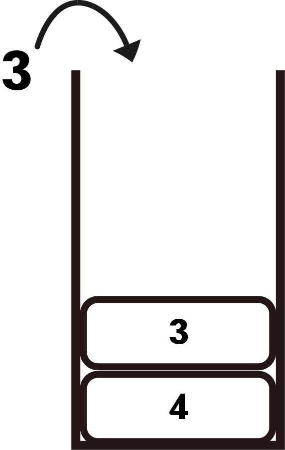
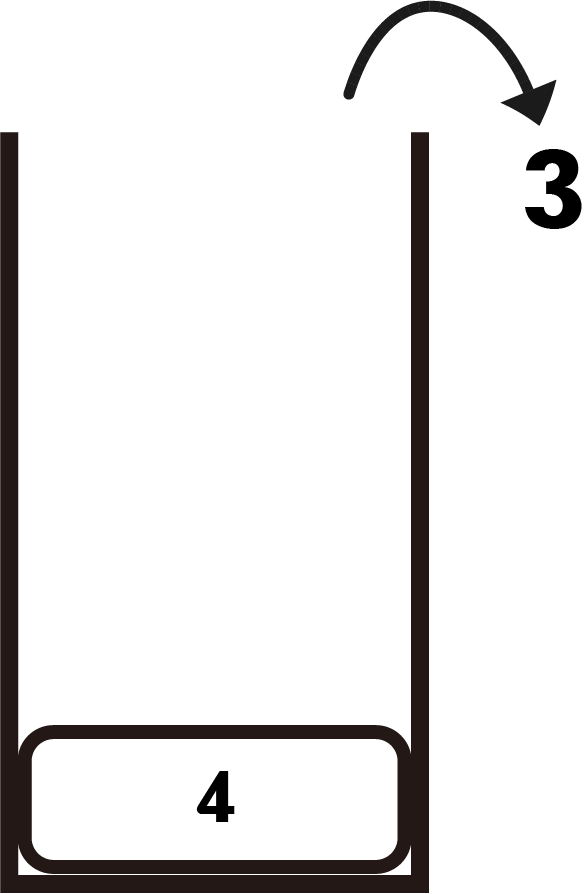

# 스택 (stack)

## 정의

먼저 들어간 데이터가 마지막에 나오는 형태의 선형자료구조 (Last-In-First-Out)

스택에 데이터를 집어넣는 행위를 push, 빼는 행위를 pop이라고 한다.






위와 같이 4번 3번 순서로 push를 했지만 pop을 하면 3번이 먼저 나오는 것을 확인할 수 있다.

## 기능 및 구현

### 리스트로 구현

```python
class stack:
    def __init__(self):
        self.size = 0
        self.data = []
    def push(self, item):
        self.data.append(item)
        self.size += 1
    def pop(self):
        if self.size > 0:
            self.data.pop()
            self.size -= 1
        else:
            return 'stack is empty'
    def empty(self):
        if self.size == 0:
            return True
        return False
    
    def top(self):
        if self.size > 0:
            return self.data[self.size - 1]
        return "stack is empty"
```

