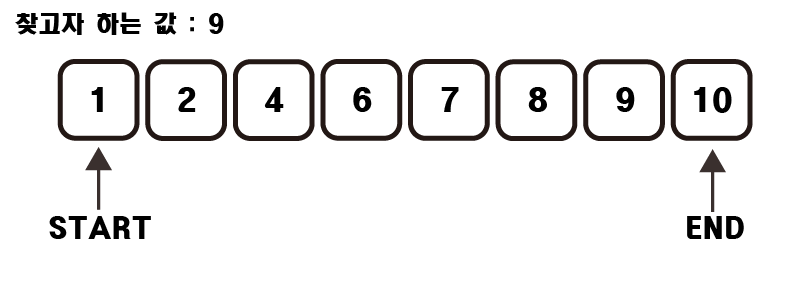

# 이분 탐색

## 1. 정의

탐색 기법 중 하나로써 찾는 범위를 절반씩 분할하여 줄여가면서 탐색하는 방법이다.

## 2. 원리



이분탐색을 진행하기 전에는 항상 리스트가 정렬되어 있어야 한다.

1. 가장 처음값과 마지막 값을 가리키는 start와 end를 만든다.

2. 중앙값을 가리키는 mid값을 만든다. 기준은 보통 (start + end) // 2 가 기준이다.

3. mid와 찾고자 하는 값을 비교한다.

4-1. 찾고자 하는 값이 mid보다 작다면 end를 mid - 1로 수정한다.

4-2. 찾고자 하는 값이 mid보다 크다면 start를 mid + 1로 수정한다.

5. 2,3,4번 과정을 찾을 때까지, 혹은 start가 end보다 커질때 까지 반복한다.

O(log n)의 시간복잡도로 리스트에서 원하는 값을 찾아낼 수 있다.

## 3.구현

```python
def binary_search(arr, value):
    start = 0
    end = len(arr) - 1
    while start < end:
        mid = (start + end) // 2
        if mid == value:
            return mid
        elif value < mid:
            end = mid - 1
        else:
            start = mid + 1
    return False
```