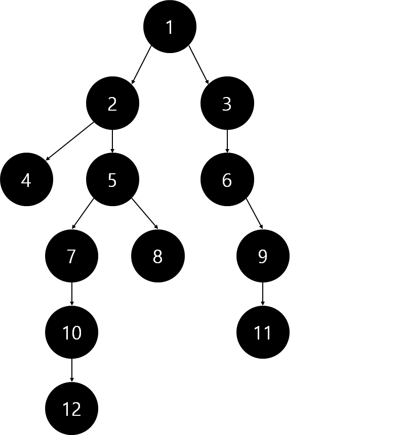
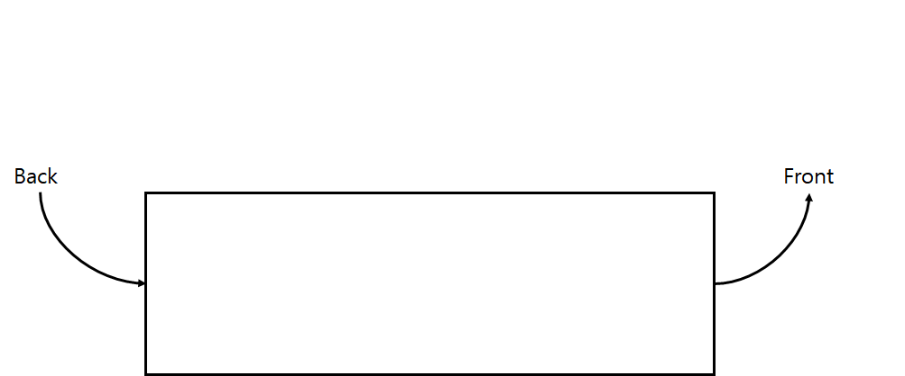
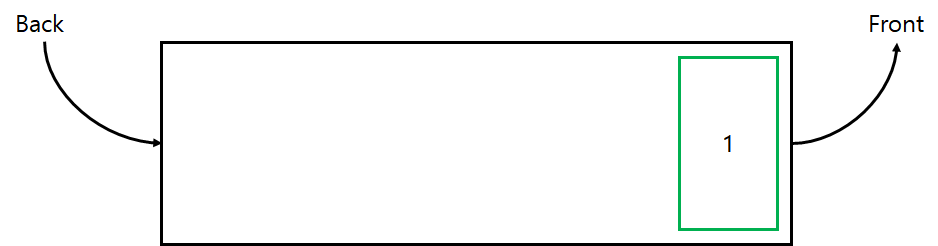
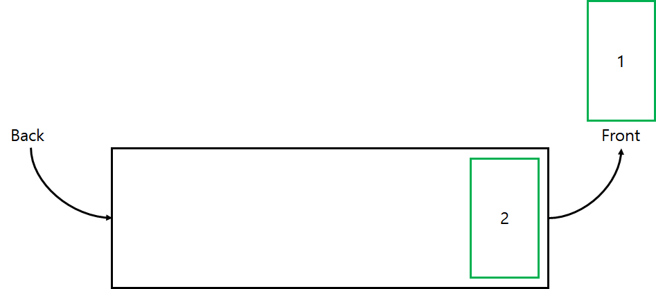
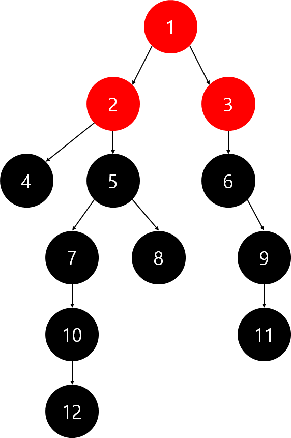
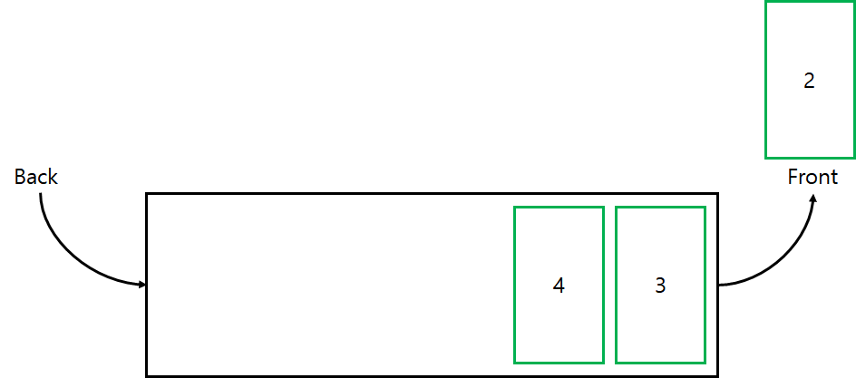
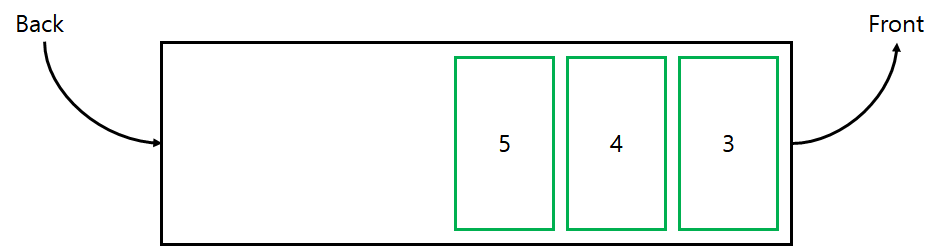
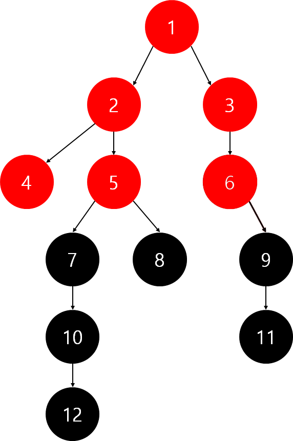
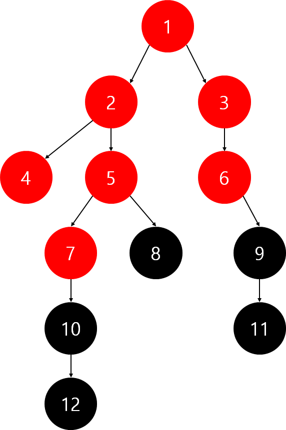

## DFS & BFS

그래프를 완전히 탐색할 때 사용하는 기법이다. 

### BFS(Breadth First Search, 너비 우선 탐색)

너비를 우선해서 탐색하는 기법으로 시작 점인 노드와 같은 거리에 있는 노드를 우선으로 탐색한다. 

**구현 방법**

queue를 이용하여 구현할 수 있다. 

탐색한 노드를 queue에 넣어주고 queue의 맨 앞에 있는 노드에 인접한 노드(이미 탐색한 노드는 제외)를 queue에 넣어주면서 모든 노드를 탐색한다.

 

**트리에서의  BFS 탐색 과정**




먼저 1번 노드에서 탐색을 시작한다. 

queue에 1을 push 해준다. 

<queue>의 현재 상태



1번 노드와 연결된 노드 중 2번 노드를 탐색한다. 

queue에서 1을 pop하고  2를 push해준다.

<queue>의 현재 상태



1번 노드와 연결된 노드 중 탐색하지 않은 노드인 3번 노드를 탐색한다. 

queue에 3을 넣어준다.

<queue>의 현재 상태 



1번 노드와 연결된 모든 노드를 탐색했으므로 다음으로 탐색했던 2번 노드와 연결된 노드 중 4번 노드를 탐색한다. 

queue에서 2를 pop하고 4를 push해준다. 

<queue>의 현재 상태



2번 노드와 연결된 노드 중 탐색하지 않은 노드인 5번 노드를 탐색한다. 

queue에 5를 push해준다.

<queue>의 현재 상태



2번 노드와 연결된 모든 노드를 탐색했으므로 2번 노드 다음으로 탐색한 3번 노드와 연결된 노드인 6번 노드를 방문한다. 

queue에서 3을 pop해주고, 6을 push해준다. 

<queue>의 현재 상태



3번 노드와 연결된 모든 노드를 탐색했으므로, 3번 노드 다음으로 탐색한 4번 노드와 연결된 노드를 탐색한다. 4번 노드와 연결된 노드가 없으므로 그 다음으로 탐색한 5번 노드와 연결된 노드 중 7번 노드를 탐색한다. 

queue에서 4를 pop해주고, 5도 pop해준 후 7을 push해준다. 

<queue>의 현재 상태



같은 방법으로 반복하여 모든 노드를 탐색한다.

queue에 아무것도 없으면 탐색을 종료한다. 

<queue>의 현재 상태


위와 과정을 통해 탐색을 하면 1 → 2 → 3 → 4 → 5 → 6 → 7 → 8 → 9 → 10 → 11 → 12의 순서로 탐색을 진행하게 된다.  

**시간복잡도**

인접 행렬 : O(V<sup>2</sup>)

인접 리스트 :  O(V + E)

**BFS 구현 코드**
```python
import queue #queue module 불러오기
n = 12 #node의 개수
check = [False for _ in range(n)] #방문여부를 체크하기 위한 배열
#인접행렬로 구현된 그래프
graph = [[0, 1, 1, 0, 0, 0, 0, 0, 0, 0, 0, 0],
				[0, 0, 0, 1, 1, 0, 0, 0, 0, 0, 0, 0],
				[0, 0, 0, 0, 0, 1, 0, 0, 0, 0, 0, 0],
				[0, 0, 0, 0, 0, 0, 0, 0, 0, 0, 0, 0],
				[0, 0, 0, 0, 0, 0, 1, 1, 0, 0, 0, 0],
				[0, 0, 0, 0, 0, 0, 0, 0, 1, 0, 0, 0],
				[0, 0, 0, 0, 0, 0, 0, 0, 0, 1, 0, 0],
				[0, 0, 0, 0, 0, 0, 0, 0, 0, 0, 0, 0],
				[0, 0, 0, 0, 0, 0, 0, 0, 0, 0, 1, 0],
				[0, 0, 0, 0, 0, 0, 0, 0, 0, 0, 0, 1],
				[0, 0, 0, 0, 0, 0, 0, 0, 0, 0, 0, 0],
				[0, 0, 0, 0, 0, 0, 0, 0, 0, 0, 0, 0]]

def bfs(n, graph, start):
    global check
    check[start] = True #시작위치 방문여부 체크
    que = queue.Queue()
    que.put(start) #시작위치 queue에 push
    while not que.empty():
        current = que.get() #현재 위치 가져오기 + pop
        print(current + 1)
        for i in range(n):
            #i위치를 갈 수 있고 queue에 push된 적이 없다면 i위치 방문하기
            if graph[current][i] == 1 and check[i] == False: 
                que.put(i)
                check[i] = True
	
```
