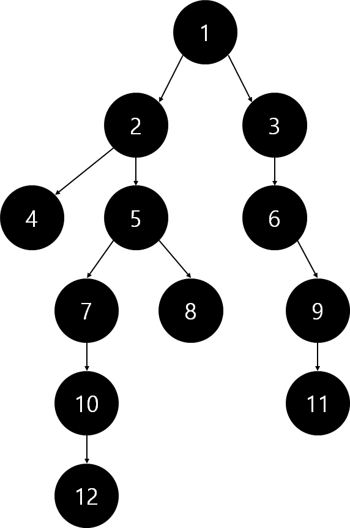
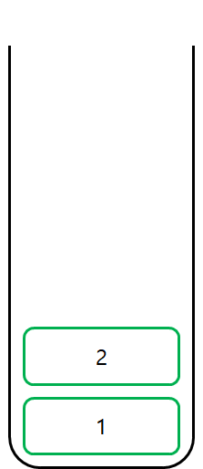
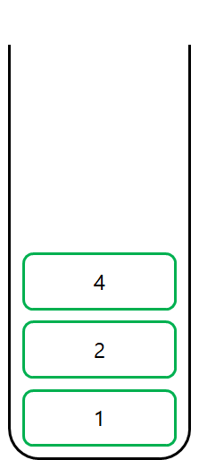
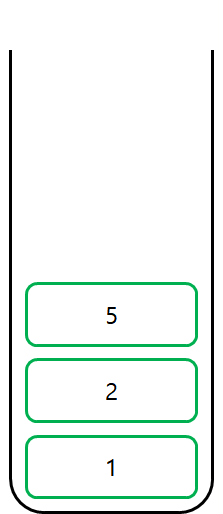
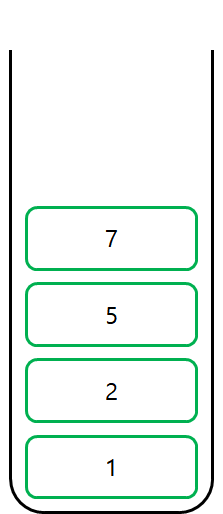
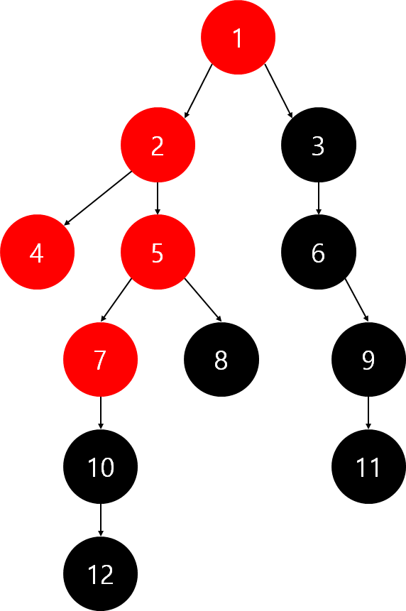

### DFS(Depth First Search, 깊이 우선 탐색)

DFS는 루트 노드, 혹은 그래프에서 하나의 정점에서 시작해서 다른 길을 탐색하기 전 탐색하는 길의 모든 경우를 탐색 하는 알고리즘이다.

미로에서 길을 찾을 때 갈림길에서 하나의 길로 갈 수 있는 모든 경우를 탐색한 뒤 다른 길을 탐색하는 것과 같은 방법이다.

주로 경우의 수 문제에서 모든 경우를 탐색해야 할 때 사용한다.

**구현 방법**

재귀함수를 이용한 방식과 stack을 이용한 방식으로 총 2개의 방식으로 구현을 할 수 있다. 

**트리에서의 DFS 탐색 과정**



먼저 1번 노드에서 탐색을 시작한다.

stack에 1을 push한다. 


1번 노드와 연결된 노드 중 한 개의 노드를 탐색한다.

stack에 2를 push한다. 



3번 노드를 탐색하지 않고 2번과 연결된 다른 노드 중 4번 노드를 탐색한다.

stack에 4를 push한다. 



4번 노드에서 탐색할 수 있는 다른 노드가 없으므로 2번과 연결된 5번 노드를 탐색한다.

stack에서 pop을 한 번 해서 4를 없애고, 5를 push한다. 



5번과 연결된 노드 중 탐색할 수 있는 노드인 7번 노드를 탐색한다.

stack에 7을 push한다. 



같은 방법으로 반복하여 모든 노드를 탐색한다.


### 이때 한번 탐색을 진행했던 노드는 다시 탐색하지 않도록 체크해야 한다.

만약 다시 탐색을 진행하게 된다면 조건에 따라 loop에 빠질 수도 있다.

위의 과정을 통해 탐색을 하면 1 → 2 → 4 → 5 → 7 → 10 → 12 → 8 → 3 → 6 → 9 → 11 의 순서로 탐색을 진행하게 된다. 

### 인접 행렬로 구현된 그래프에서의 dfs

**시간복잡도**

인접 행렬 : O(V<sup>2</sup>)

인접 리스트 :  O(V + E)

**재귀 함수로 DFS 구현**

```python
n = 12 #node의 개수
check = [False for _ in range(n)] #방문여부를 체크하기 위한 배열
#인접행렬로 구현된 그래프
graph = [[0, 1, 1, 0, 0, 0, 0, 0, 0, 0, 0, 0],
		[0, 0, 0, 1, 1, 0, 0, 0, 0, 0, 0, 0],
		[0, 0, 0, 0, 0, 1, 0, 0, 0, 0, 0, 0],
		[0, 0, 0, 0, 0, 0, 0, 0, 0, 0, 0, 0],
		[0, 0, 0, 0, 0, 0, 1, 1, 0, 0, 0, 0],
		[0, 0, 0, 0, 0, 0, 0, 0, 1, 0, 0, 0],
		[0, 0, 0, 0, 0, 0, 0, 0, 0, 1, 0, 0],
		[0, 0, 0, 0, 0, 0, 0, 0, 0, 0, 0, 0],
		[0, 0, 0, 0, 0, 0, 0, 0, 0, 0, 1, 0],
		[0, 0, 0, 0, 0, 0, 0, 0, 0, 0, 0, 1],
		[0, 0, 0, 0, 0, 0, 0, 0, 0, 0, 0, 0],
		[0, 0, 0, 0, 0, 0, 0, 0, 0, 0, 0, 0]]

#dfs함수 구현
"""
parameter : 
	n : 노드개수
	graph : 그래프
	current : 현재 탐색중인 노드
"""
def dfs(n,graph,current):
    global check
    check[current] = True #방문 여부 체크
    print(current+1)
	#반복문 돌면서 방문하지 않은 노드를 우선으로 탐색 (재귀적 탐색)
    for i in range(n):
        if graph[current][i] == 1 and check[i] == False:
            dfs(n, graph, i)

#함수 실행
dfs(n,graph,0)
```

**스택으로 dfs 구현하기**

recursive가 아닌 interative에서는 스택의 상태와 동시에 각 노드별 방문 상태를 저장해야 한다.

```python
n = 12 #node의 개수
check = [False for _ in range(n)] #방문여부를 체크하기 위한 배열
#인접행렬로 구현된 그래프
graph = [[0, 1, 1, 0, 0, 0, 0, 0, 0, 0, 0, 0],
		[0, 0, 0, 1, 1, 0, 0, 0, 0, 0, 0, 0],
		[0, 0, 0, 0, 0, 1, 0, 0, 0, 0, 0, 0],
		[0, 0, 0, 0, 0, 0, 0, 0, 0, 0, 0, 0],
		[0, 0, 0, 0, 0, 0, 1, 1, 0, 0, 0, 0],
		[0, 0, 0, 0, 0, 0, 0, 0, 1, 0, 0, 0],
		[0, 0, 0, 0, 0, 0, 0, 0, 0, 1, 0, 0],
		[0, 0, 0, 0, 0, 0, 0, 0, 0, 0, 0, 0],
		[0, 0, 0, 0, 0, 0, 0, 0, 0, 0, 1, 0],
		[0, 0, 0, 0, 0, 0, 0, 0, 0, 0, 0, 1],
		[0, 0, 0, 0, 0, 0, 0, 0, 0, 0, 0, 0],
		[0, 0, 0, 0, 0, 0, 0, 0, 0, 0, 0, 0]]

def dfs(n, graph, start):
    global check

    #시작지점을 stack에 넣는다
	stack = [[start, 0]]
	check[start] = True

    while len(stack) != 0:
        top = stack[len(stack)-1]

        if top[1] == 0:
            print(top[0]+1)
		#stack top으로부터 갈 수 있는 장소가 있다면 stack에 넣고 다음 노드를 탐색한다.
        for i in range(top[1],n):
            if check[i] == False and graph[top[0]][i] == 1:
                stack[len(stack) - 1] = top
                stack.append([i,0])
                check[i] = True
                break
			#탐색 노드를 업데이트한다.
            top[1] += 1
		#해당 노드에 대한 탐색이 끝났다면 pop해준다.
        if top[1] == n:
            stack.pop()

#dfs함수 실행
dfs(n, graph, 0)
```

위와 같이 구현을 진행했을 때 단순히 스택에 집어넣고 빼는 작업만이 아닌 부가적인 코드와
탐색했던 노드와 탐색중인 노드, 탐색이 끝난 노드에 따른 알고리즘이 있어 생각하기 어렵다

```python
def dfs(n, graph, start):
    global check
    stack = [start]
    
    while len(stack) != 0:
        top = stack[len(stack) - 1]
        print(top+1)
        stack.pop()
        for i in range(n-1, -1, -1):
            if graph[top][i] == True and check[i] == False:
                stack.append(i)
                check[i] = True
#함수 실행
dfs(n,graph,0)
```

BFS와 비슷한 구조를 가지고 있지만 자료구조에 접근하는 순서가 조금 다르다.