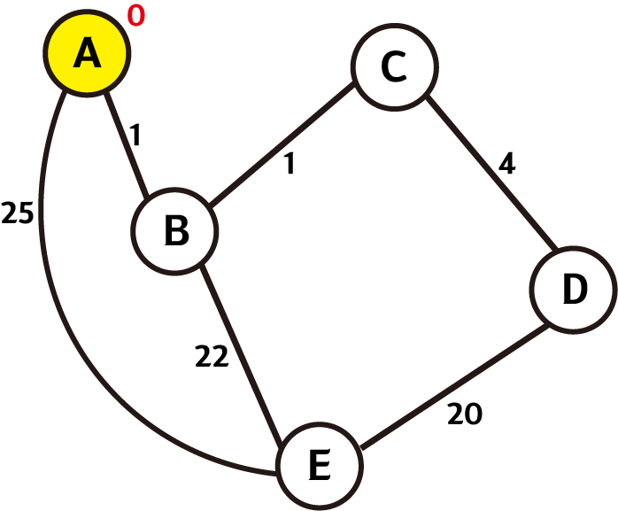
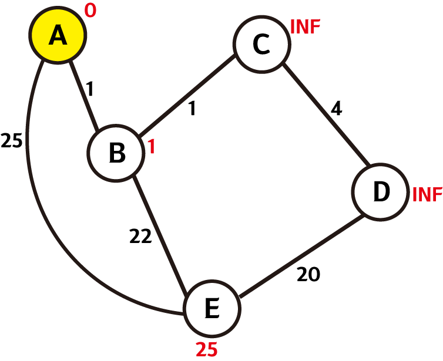
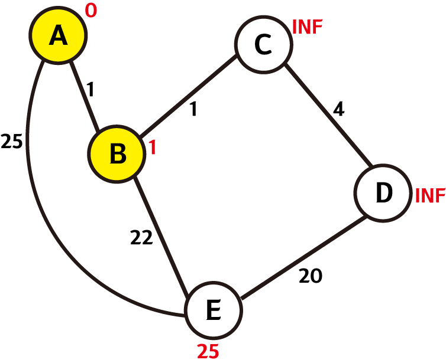
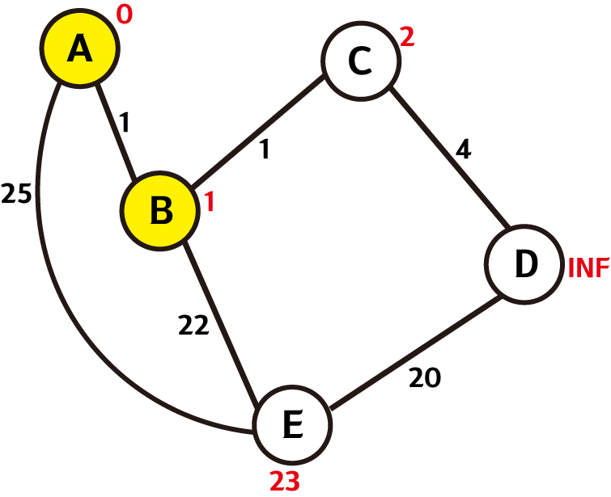
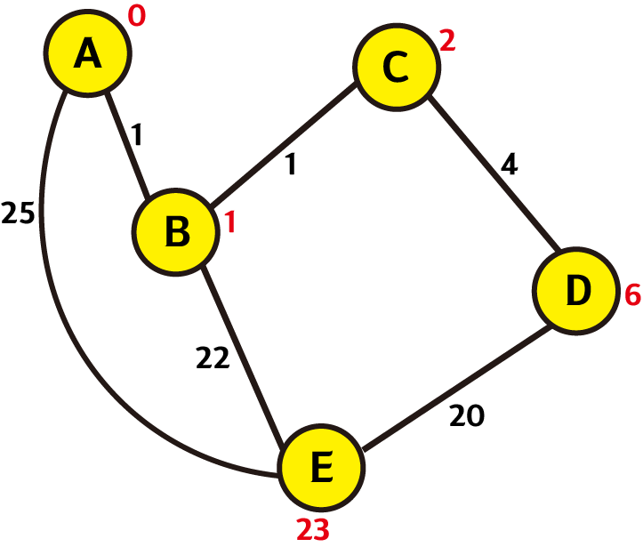

# 다익스트라 알고리즘 (Dijkstra Algorithm)

## 1. 정의

다익스트라 알고리즘은 가중치가 있는 그래프상에서 한 정점으로부터 다른 정점까지의 최단 경로(최소 가중치)를 구하는 알고리즘이다.

데이크스트라 알고리즘이라고도 한다.

## 2. 원리

다익스트라 알고리즘은 최단거리를 구하기 위해서 이전 노드까지의 거리를 기억하여 이용하는 다이나믹 프로그래밍으로 구현된다.

위의 그래프에서 A노드에서부터 다른 노드까지의 최소 가중치를 구하고자 한다.

|A|B|C|D|E|
|---|---|---|---|---|
|0|INF|INF|INF|INF|

처음에는 시작노드를 선택하고 해당 가중치를 0으로 놓는다.

|A|B|C|D|E|
|---|---|---|---|---|
|0|1|INF|INF|25|

시작노드에서 갈 수 있는 노드의 값을 수정한다. 예시에서는 A노드에서 B,E노드로 갈 수 있고 각각 1, 25 가중치를 가진다.

선택되지 않은 노드들중 가장 현재 가장 적은 가중치 값을 가지는 노드를 선택한다.

예시에서는 B노드가 1로서 다른 노드들보다 적은 값을 가지고 있다.

|A|B|C|D|E|
|---|---|---|---|---|
|0|1|2|INF|23|

선택된 노드에서 갈 수 있는 노드들의 값을 바꾼다. 이 때 기존에 저장되어 있는 가중치와 선택된 노드를 거쳐서 가는 가중치를 비교하여 최솟값을 저장한다.

위 예시에서 C노드는 기존의 INF 보다 B를 거쳐서 가는 1(B까지 가는데 필요한 최소 가중치) + 1(B에서 C로 가는데 필요한 가중치)가 작으므로 2로 변경한다.

E노드 또한 기존의 가중치 25보다 B를 거처서 가는 1(B까지 가는데 필요한 최소 가중치) + 22(B에서 E까지 가는데 필요한 가중치)가 작으므로 23으로 변경한다.

현재 선택된 노드가 choice, 수정하고자 하는 노드가 N일때 규칙은 다음과 같다.

DP[N] = min(DP[N], DP[choice] + graph[choice][N])

반복해서 선택되지 않은 노드들중 최소 가중치를 가지는 노드를 선택, 갈 수 있는 노드들에 대해 위의 규칙을 적용하면 출발노드로부터 각 노드까지의 최소 가중치를 구할 수 있다.

