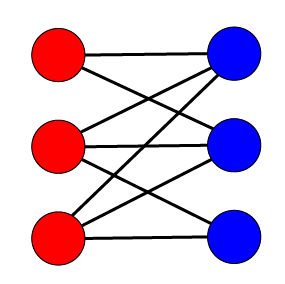

# 이분그래프

## 1. 정의

인접한 접점(Node)끼리 서로 다른 색으로 칠했을 때 모든 정점을 두가지 색으로만 채울 수 있는 그래프를 **이분그래프**라고 한다.



## 2. 탐색

그래프가 주어졌을 때 이분그래프인지 확인하는 방법은 [DFS](./DFS.md) 혹은 [BFS](./BFS.md)를 이용한다.

그래프를 처음부터 색칠해가면서 탐색 하다가 이미 색칠되어 있는 노드가 맞지 않을 경우 false, 완전히 다 색칠을 끝냈다면 true를 반환하면 된다.

해당 과정을 모든 간선, 모든 노드에 대해서 탐색을 진행하여야 한다.

## 3. 코드

```python
import queue from Queue
'''
name : is_bipartite_graph
parameter :
    graph : 그래프 정보 (인접리스트 형태)
        - example : graph = [[[2,False],[3,False]], [], []]
        - 연결정보와 같이 해당간선을 탐색했는지 알 수 있도록 boolean 값을 추가한다.
    n : 노드의 개수
'''
def is_bipartite_graph(graph, n):
    color = ['none' for _ in range(n+1)]
    while True:
        que = Queue()
        for i in range(1,n+1):
            if color[i] == 'none':
                que.put(i)
                color[i] = 'blue'
                break
        if que.empty():
            break
        while not que.empty():
            front = que.get()
            for i in graph[front]:
                if i[1] == False and color[i[0]] == 'none':
                    if color[front] == 'blue':
                        color[i[0]] = 'red'
                    else:
                        color[i[0]] = 'blue'
                    que.put(i[0])
                elif i[1] == False and color[front] == color[i[0]]:
                    return False
                i[1] = True
    return True 
```


