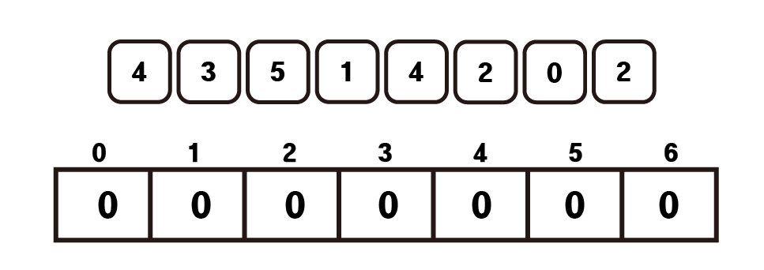
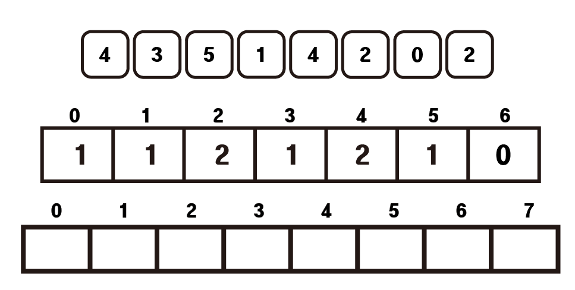

# 계수정렬 (Counting Sort)

## 1. 정의

정렬하고자 하는 배열의 값이 등장하는 횟수를 저장하여 정렬하는 방법

배열의 값을 보고 해당 값을 인덱스로 하는 새로운 배열에 등장 횟수를 저장, 배열을 처음부터 읽으면서 정렬할 수 있다.

시간복잡도는 O(n + k) 배열의 개수와 값의 범위에 영향을 받는다.

따라서 값의 범위가 작을 때에는 시간적으로 다른 정렬들보다 효율적이지만 값의 범위가 커지면 시간적으로도 비효율적이며

값의 범위만큼 배열이 필요하기 때문에 공간적으로도 비효율적이다.

## 2. 원리와 구현



각각의 배열을 처음부터 보면서 해당 값을 인덱스로 하는 배열에 개수를 저장시킨다.

배열을 처음부터 읽으면서 해당 배열의 개수만큼 인덱스를 저장하여 반환한다.

```python
def counting_sort(arr):
    max_value = max(arr)
    count_arr = [0 for i in range(max_value + 1)]
    result = []
    for i in arr:
        count_arr[i] += 1
    for i in range(max_value + 1):
        for j in range(count_arr[i]):
            result.append(i)
    return result
```

위와 같이 구현시 정렬 과정에서 동일 값들에 대해 기존 배열과의 순서가 달라질 수 있다. 

이것은 단순히 값을 정렬할 때에는 큰 의미가 없지만, 객체를 저장하고 특정기준에 따라 정렬해야 할 시 정렬 기준이 같다면 기존배열과 순서가 달라져서는 안된다. 이를 **stable하게 만든다**라고 하는데 순서를 유지시켜주기 위해 누적합을 이용할 수 있다.



기존의 개수를 세었던 배열을 다시 돌면서 누적합 배열로 만든다.

이후 배열을 거꾸로 돌면서 누적합을 확인한다.

배열값의 누적합 값을 1뺀 후 누적합 값을 인덱스로 하는 위치에 배열값을 저장시킨다.

```python
def counting_sort(arr):
    length = len(arr)
    max_value = max(arr)
    count_arr = [0 for i in range(max_value + 1)]
    result = [0 for i in range(length)]

    for i in arr:
        count_arr[i] += 1
    for i in range(1,max_value + 1):
        count_arr[i] += count_arr[i-1]
    for i in range(length-1, -1, -1):
        count_arr[arr[i]] -= 1
        result[count_arr[arr[i]]] = arr[i]
    return result
```

