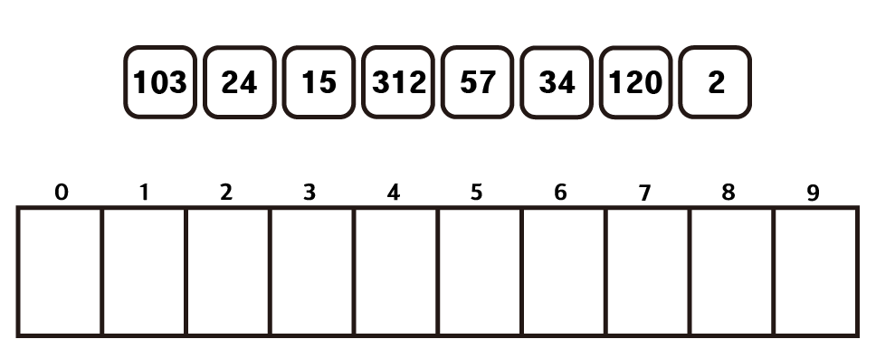
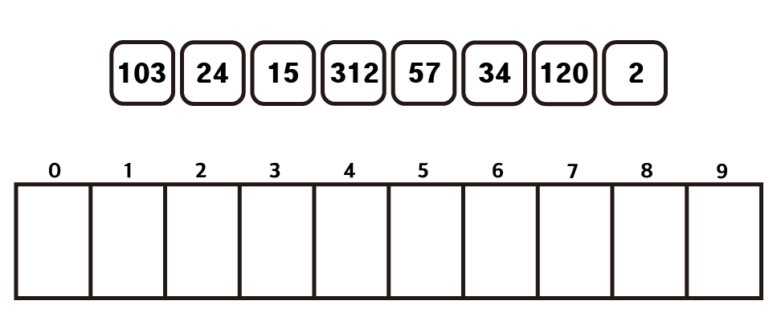

# 기수정렬 (Radix Sort)

## 1. 정의

counting sort의 메모리 문제를 보완하기 위하여 나온 정렬방법

각 숫자의 자리수를 이용하여 정렬하는 방법이다.

시간복잡도는 O(dn)으로 정렬하고자 하는 숫자의 개수와 최대자리수의 영향을 받는다.

## 2. 원리





각 자리수에 맞춰 저장할 수 있도록 0부터 9까지의 인덱스를 가지는 배열을 준비한다.

이때 각 배열 칸에 여러개의 숫자를 저장할 수 있도록 배열이나 큐를 이용하도록 한다.


각 수의 일의자리에 맞는 배열 칸에 숫자를 집어넣는다.


0번째 인덱스부터 들어간 숫자들을 차례로 꺼내면서 정렬한다.


십의 자리에 맞춰서 위와 동일하게 각 배열칸에 숫자를 다시 집어 넣는다.


0번째 인덱스부터 들어간 순서대로 빼내며 정렬한다.


백의 자리수도 마찬가지로 진행하며 가능한 모든 자리까지 진행하면 정렬이 완료된다.

## 3. 구현

```python
def radix_sort(arr):
    n = len(arr)
    result = arr
    count = 0
    
    while True:
        radix = [[] for _ in range(10)]

        for i in result:
            number = (i // (10 ** (count))) % 10
            radix[number].append(i)
        
        result = []

        for i in range(10):
            length = len(radix[i])
            for j in range(length):
                result.append(radix[i][j])
        
        if len(radix[0]) == n:
            break
        count += 1
    return result
```