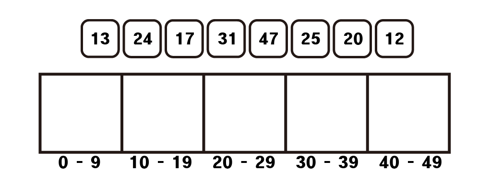

# 버킷정렬 (Bucket sort)

## 1. 정의

배열안의 원소들을 특정기준으로 나뉘어진 버킷(bucket)에 담아 정렬하는 방법이다. 기수정렬(radix sort)와 비슷하다.

## 2. 원리



각각의 원소들을 숫자 범위별로 나누어 정렬을 진행하는 방법이다.

1. 각각의 원소들을 해당하는 숫자범위에 맞는 리스트에 넣는다.

2. 각각의 리스트들을 정렬한다.

3. 앞의 리스트부터 차례대로 배열에 넣는다.

이때 각각의 리스트를 정렬할 때는 보통 [삽입정렬](./삽입정렬.md)를 이용하나 다른 정렬을 이용해도 무방하다.

## 3. 구현

```python
def radix_sort(arr):
    bucket = [[] for _ in range(10)]
    result = []
    for i in arr:
        bucket[i // 10].append(i)
    for i in range(len(bucket)):
        bucket[i] = insertion_sort(bucket[i])
    for i in bucket:
        for j in i:
            result.append(j)
    return result
```