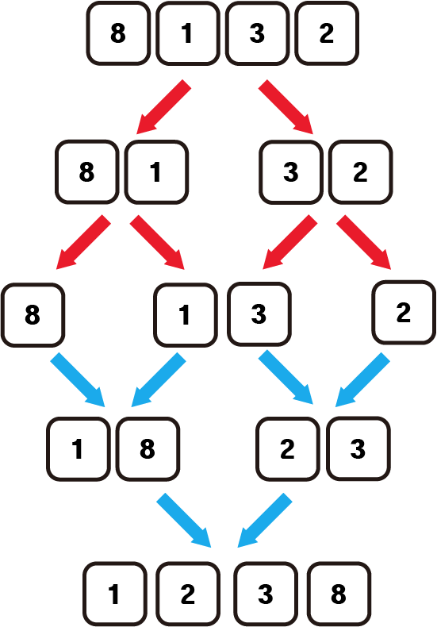

# 병합정렬(MergeSort)

## 1. 정의


합병정렬은 주어진 배열을 잘게 쪼갠다음 붙여나가면서 정렬하는 방법이다.

큰 배열을 정렬하려는 문제를 작게 쪼개어 정렬하며 해결하는 알고리즘 **divide and conquer** 방식으로 해결한다.



**시간복잡도** : O(n log n)

## 2. 구현

```python
def merge(arr, start, end, mid):
    result = []
    point1 = start
    point2 = mid+1

    #각 배열의 포인터 위치 값들끼리 비교하며 작은값 먼저 result배열에 집어넣는다.
    while point1 <= mid and point2 <= end:
        if arr[point1] < arr[point2]:
            result.append(arr[point1])
            point1 += 1
        elif arr[point1] > arr[point2]:
            result.append(arr[point2])
            point2 += 1
    #비교하지 않은 나머지 배열들을 채워 넣는다.
    while point1 <= mid:
        result.append(arr[point1])
        point1 += 1
    while point2 <= end:
        result.append(arr[point2])
        point2 += 1

    #원래의 배열에 복사해 넣는다.
    copy = 0
    for i in range(start, end+1):
        arr[i] = result[copy]
        copy += 1
    return arr
    
def mergeSort(arr, start, end):
    if start < end:
        mid = (start + end) // 2
        mergeSort(arr, start, mid)
        mergeSort(arr, mid+1, end)
        merge(arr, start, end, mid)
    return arr
```

병합할 때는 나뉘어진 두개의 배열에서 각자의 포인터를 두고 포인터위치의 값들끼리 비교해가면서 병합배열을 채워나간다.