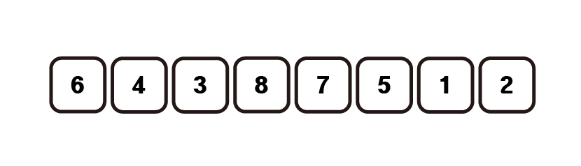

# 삽입정렬(Insertion Sort)

## 1. 원리



두번째 원소부터 시작하여 앞의 원소들과 비교하며 적절한 위치에 삽입을 하며 정렬하는 알고리즘이다.

순서는 다음과 같다.

- 1. 두번째 원소부터 시작하여 자신의 앞의 원소들과 비교하여 들어갈 위치를 찾는다.

- 2. 들어갈 위치를 비울 수 있도록 해당 위치와 원래 자리 사이의 원소들을 뒤로 한칸씩 미룬다.

- 3. 해당 위치에 데이터를 들여 놓는다.

위 작업을 끝까지 반복한다.

**시간복잡도** : O(n<sup>2</sup>)

## 2. 구현

```python
def insertionSort(arr):
    size = len(arr)
    for i in range(1,size):
        key = arr[i]
        j = i - 1
        while j>=0 and key < arr[j]:
            arr[j+1] = arr[j]
            j -= 1
        arr[j+1] = key
    return arr
```