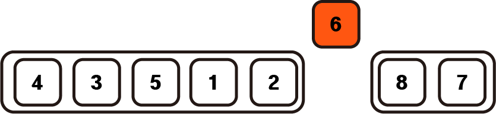
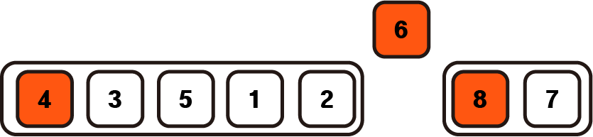
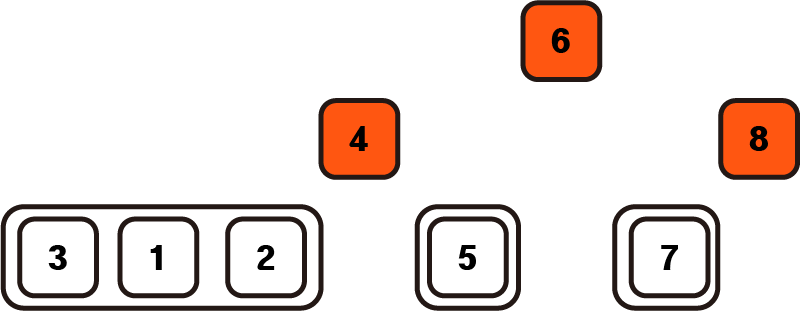
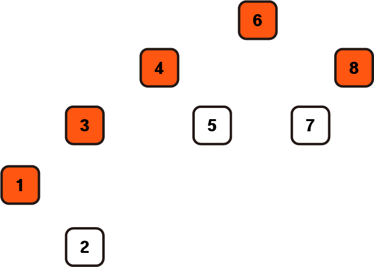

# 퀵 정렬(Quick Sort)

## 1. 원리

퀵정렬은 병합정렬과 같이 큰 배열을 잘개 쪼개어 정렬하는 방법이다. 그러나 병합정렬은 배열을 균등하게 나누어 정렬을 진행하지만 퀵정렬은 비균등하게 쪼개어 정렬한다.

## 2. 과정

1. 배열의 하나의 수를 pivot으로 정한다.

2. pivot을 기준으로 작은 수를 왼쪽 배열에, 큰 수를 오른쪽 배열에 옮긴다.

3. pivot을 제외한 왼쪽 배열, 오른쪽 배열을 다시 정렬한다 (**divide and conquer**)

4. 배열의 크기가 0 또는 1이 될 때까지 반복한다.

5. 쪼개어진 배열을 왼쪽배열, pivot, 오른쪽 배열 순으로 합친다.

### 예시


위와 같은 배열이 있다고 가정하자


제일 앞의 6을 pivot으로 설정한다.



pivot을 기준으로 작은 수를 왼쪽배열, 큰 수를 오른쪽 배열에 넣는다.



동일하게 왼쪽배열에서 앞의 수, 오른쪽 배열에서의 앞의 수를 pivot으로 정한다.



해당 pivot을 기준으로 동일하게 나눈다.



동일하게 나눈 이후에 왼쪽 pivot 오른쪽 배열 순으로 합치면 정렬이 완료된다.

## 3. 구현

```python
def quickSort(arr, left, right):
    right_pointer = 0
    if left < right:
        pivot = arr[left]
        left_pointer = left + 1
        right_pointer = right

        while left_pointer <= right_pointer:
            while left_pointer <= right and arr[left_pointer] < pivot:
                left_pointer += 1
            while right_pointer >= left and arr[right_pointer] > pivot:
                right_pointer -= 1
            if left_pointer < right_pointer:
                temp = arr[left_pointer]
                arr[left_pointer] = arr[right_pointer]
                arr[right_pointer] = temp
        
        temp = arr[left]
        arr[left] = arr[right_pointer]
        arr[right_pointer] = temp
        print(arr, left, right_pointer)

        quickSort(arr, left, right_pointer-1)
        quickSort(arr, right_pointer + 1, right)
```
 
pivot을 기준으로 나누는 작업을 자리를 바꿔가면서 진행한 코드이다. 왼쪽 배열, 오른쪽 배열을 따로 생성하는 것보다 메모리 사용을 줄일 수 있다.