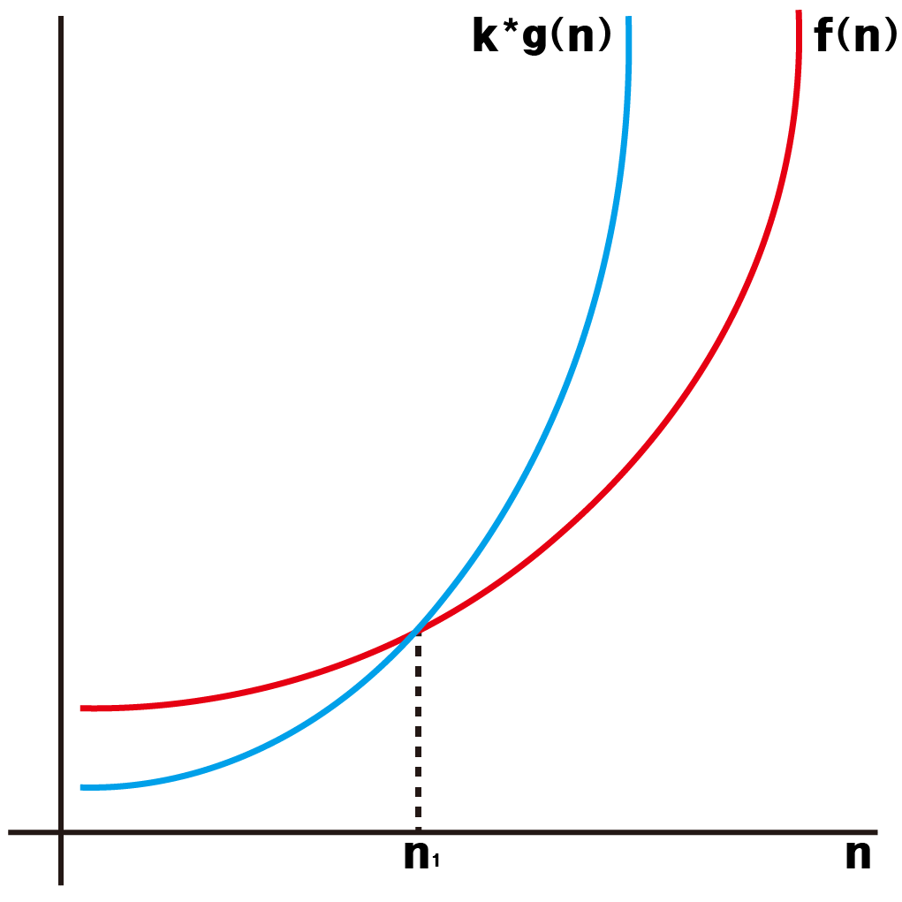

# 시간복잡도와 공간복잡도 (Time complexity and Space comlexity)

## 1. 정의

프로그램을 구현하기 위해서 알고리즘을 구상할 때 해당 알고리즘의 효율성을 계산하기 위한 방법

해당 알고리즘이 실행되는데 걸리는 시간을 기준으로 한 시간복잡도(Time complexity)와

알고리즘을 구현하는 데 필요한 메모리의 양을 기준으로 하는 공간복잡도(Space comlexity)를 기준으로 효율성을 판별한다.

## 2. 효율성 계산이 필요한 이유

n개의 데이터를 처리하기 위하여 n<sup>2</sup>초의 시간이 필요한 알고리즘 A와 2<sup>n</sup>초의 시간이 필요한 알고리즘 B가 있다고 가정하자.

100개의 데이터를 처리하기 위해서는 A의 경우 10000초가 필요하지만 

B알고리즘의 경우에는 2<sup>100</sup>초, 1267650600228229401496703205376초가 필요하고 이것은 약 401해(40100000000000000000000)년이 필요한 시간이다.

또한 컴퓨터의 메모리는 제한적이고 알고리즘을 구현하는데 무한한 메모리를 사용할 수 없다. 예를 들어 컴퓨터의 메모리가 16GB이지만 알고리즘을 구현하는데 10TB가 필요하다면 메모리가 부족하여 해당 정보를 저장할 수 없다.

따라서 알고리즘을 구상하면서 해당 알고리즘의 시간적, 공간적 효율성을 계산하여 적합한 알고리즘인지 판별할 수 있어야 한다.

## 3. 공간복잡도

공간복잡도는 해당 알고리즘을 구현하는데 필요한 메모리의 양을 기준으로 계산한다.

단순하게 생각했을 때 파이썬에서 변수안에서 데이터를 저장할 때 해당 데이터가 메모리에 저장되고 이 저장되는 양이라고 생각하면 된다.

주로 byte단위로 구분하여 사용한다.

c언어 혹은 다른 언어의 경우 변수에 저장되는 타입에 따라 메모리 양이 결정되는데 (c언어의 경우 int형 타입은 4byte)

파이썬의 경우 타입이 아닌 해당 객체 내용에 따라 메모리의 양이 달라진다.

```python
from sys import getsizeof

a = 42
print(getsizeof(a))
a = 2**1000
print(getsizeof(a))

```
getsizeof는 변수에 할당된 메모리의 크기를 byte단위로 반환해주는 함수이다

위의 코드를 실행하면 28, 160이 출력되는데 안의 값에 따라 달라짐을 확인할 수 있다.

### 메모리 단위

가장 작은 메모리 단위 bit(비트)

1 byte = 8 bit

1 KB = 1024 byte

1 MB = 1024 KB

1 GB = 1024 MB

1 TB = 1024 GB


## 4. 시간복잡도

시간복잡도는 프로그램이 동작하는데 걸리는 시간을 기준으로 한다.

프로그램이 동작할 때 기본적인 연산(+, -, *, / 등)에도 시간이 필요하지만 변수에 값을 저장, 할당하는 행위에 비해 매우 적은 시간이 필요하므로 시간복잡도를 계산할 때는 무시한다.

즉, 변수에 값이 할당되는 동작을 기준으로 시간복잡도를 계산한다.

약 1억번의 연산이 있을 경우 약 1초의 시간이 필요하다.

### 예시

```python
a = 0
for i in range(n):
    a += 1
```

위의 코드에서는 a = 0 에서 1번,

i에 차례로 0 ~ n-1 까지 저장되는 횟수 n번

a += 1에서 더해서 a에 저장되는 횟수 n번

따라서 시간복잡도는 2n + 1로 나타낸다.


## 5. 시간복잡도 표기법

매번 모든 코드를 위와 같이 횟수를 세어서 계산하기란 쉽지 않다.

따라서 시간복잡도를 표기할 때는 간략화된 방법으로 표기를 한다.

### 빅오표기법 (Big-Oh)

빅오표기법은 알고리즘 입력값에 따라서 나올 수 있는 시간복잡도중 최악의 경우를 간단하게 표기하는 방법이다.

프로그래밍을 진행할 때 보통 최악의 경우를 가정하기 때문에 가장 많이 쓰는 표기법이다.

정의는 다음과 같다.

> 두 함수 f(n), g(n)이 있을 때, 모든 n1 <= n 에 대하여 f(n) <= k * g(n) 을 만족하는 양의 상수 k와 n1이 존재하면 f(n) = O(g(n))이다.

정의를 보았을 때는 굉장히 어려워 보이지만 예시를 보면 어렵지 않다.

어떤 알고리즘의 시간복잡도 f(n) = 2n<sup>2</sup>+3n+2 라고 가정하고 g(n)을 n<sup>2</sup>라고 가정하면 n1과 k가 존재하므로 f(n) = O(n<sup>2</sup>)라고 나타낼 수 있다.

당연하게도 O(n<sup>3</sup>)도 위 f(n)의 빅오표기법에 맞지만 가능한 가장 가깝게 표기를 한다.

대부분의 경우에는 원래의 시간복잡도에서 가장 높은 차수의 항에서 계수를 제거하면 빅오로 나타낼 수 있다.



### 빅오메가표기법 (Big-Omega)

빅오메가표기법은 최선의 경우를 나타낼때 이용한다.

정의는 다음과 같다.

두 함수 f(n), g(n)이 있을 때, 모든 n1 <= n 에 대하여 f(n) >= k * g(n) 을 만족하는 양의 상수 k와 n1이 존재하면 f(n) = &Omega;(g(n)) 이다.

정의를 보았을 때는 굉장히 어려워 보이지만 예시를 보면 어렵지 않다.

어떤 알고리즘의 시간복잡도 f(n) = 2n<sup>2</sup>+3n+2 라고 가정하고 g(n)을 n<sup>2</sup>라고 가정하면 n1과 k가 존재하므로 f(n) = &Omega;(n<sup>2</sup>) 라고 나타낼 수 있다.

&Omega;(n) 또한 위 함수의 빅 오메가 표기법이지만 빅오와 마찬가지라 가장 가깝게 표기를 한다.


## 6. 시간복잡도의 비교

시간복잡도를 비교할 때 입력값에 따라서 다른 시간복잡도의 식이지만 같은 시간복잡도가 나올 수도 있다.

예를 들어 알고리즘 A의 시간복잡도는 n<sup>2이고 알고리즘 B의 시간복잡도는 
