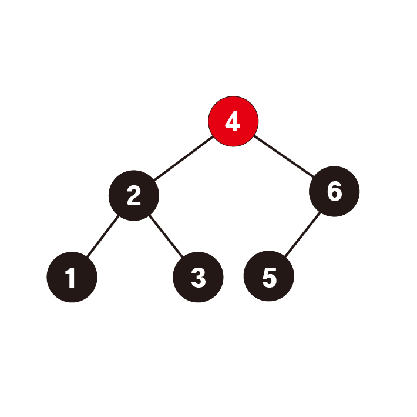
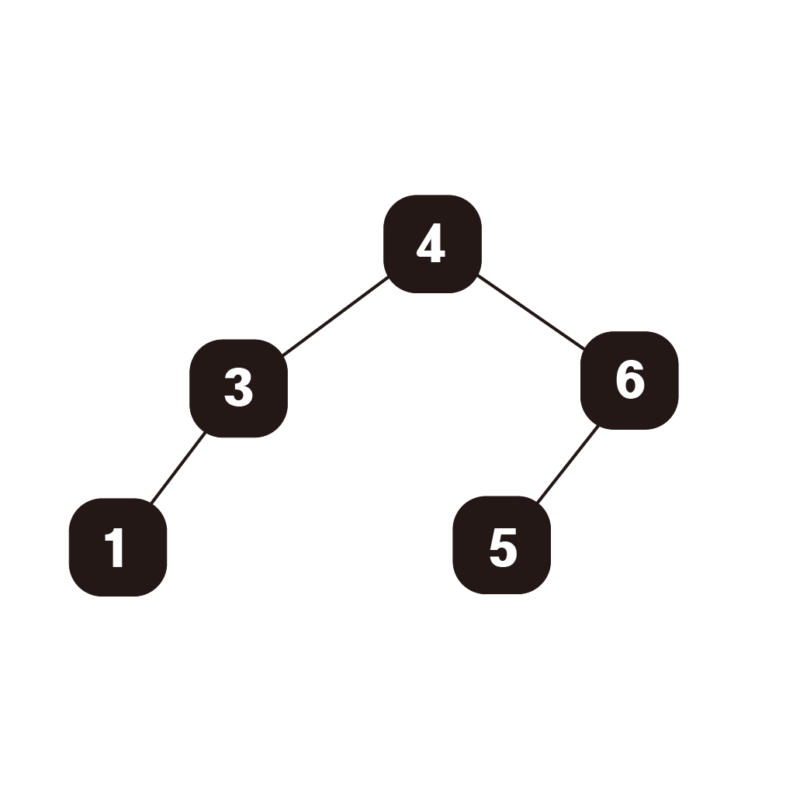

# 이진탐색트리 (Binary Search Tree)

## 정의

효율적인 탐색능력과 자료의 입력과 삭제가 원할하도록 형태를 정의한 트리이다.

## 특징

이진탐색트리는 다음과 같은 특징들을 가지고 있다.

- 각 노드의 왼쪽 서브트리에는 해당노드의 값보다 작은 값들만을 가지고 있다.

- 각 노드의 오른쪽 서브트리에는 해당노드의 값보다 큰 값들만을 가지고 있다.

- 각 왼쪽서브트리, 오른쪽 서브트리도 이진탐색트리이다.


## **시간복잡도**
탐색 : O(h)
삽입 : O(h)
삭제 : O(h)

binary search tree를 이용할 때 시간복잡도는 O(log n)으로 계산을 하나 정확히는 트리의 높이에 비례하는 O(h)이다.


위와 같은 경우에는 노드의 개수가 적지만 높이가 높아 O(n)으로 탐색을 진행할 수 있다.

위와 같은 경우를 방지하기 위해서 삽입, 삭제과정에서 양쪽의 균형을 잡아주는 AVL트리, red_black 트리가 있다.

## 구현과 과정

기본적인 노드 구조와 트리 구조를 가지고 있다.

```python
class Node:
    def __init__(self, data):
        self.data = data
        self.leftNode = None
        self.rightNode = None

class BinarySearchTree:
    def __init__(self):
        self.root = None
    def setRoot(self, data):
        self.root = Node(data)
```

### 탐색

특정값의 탐색시에는 root노드부터 비교해가면서 찾는값이 탐색중인 노드보다 크다면 오른쪽 자식노드로, 작다면 왼쪽자식노드로 이동하면서 찾는다.

다음은 해당 트리에서 3값을 탐색할때의 과정이다.



1. 루트 노드를 탐색한다.


2. 찾고자 하는 값이 루트노드보다 작다면 왼쪽노드, 크다면 오른쪽 노드로 이동하여 탐색한다.


3. 찾고자 하는 값이 루트노드보다 작다면 왼쪽노드, 크다면 오른쪽 노드로 이동하여 탐색한다. 찾았다면 반환해준다.


다음은 특정값을 탐색하는 코드이다. 현재 탐색중인 노드보다 찾는 값이 크다면 오른쪽 자식노드로, 작다면 왼쪽 자식노드로 재귀적으로 탐색한다.

```python
    def search(self,data):
        if not self.searchNode(self.root, data):
            return False
        return True

    def searchNode(self, currentNode, data):
        if currentNode == None:
            return False
        elif currentNode.data == data:
            return currentNode
        elif currentNode.data < data:
            self.searchNode(currentNode.rightNode, data)
        else:
            self.searchNode(currentNode.leftNode, data)
```

### 삽입

데이터 삽입시에는 root노드부터 비교하면서 적절한 leaf노드 위치에 삽입한다.

중간에 삽입시 서브트리가 이진탐색트리가 아니게 변할 수 있으므로 항상 leaf노드에 삽입한다.



```python
    def insert(self, data):
        if self.root == None:
            self.setRoot(data)
        else:
            self.insertNode(self.root, data)

    def insertNode(self, currentNode, data):
        if currentNode.data <= data:
            if currentNode.rightNode == None:
                currentNode.rightNode = Node(data)
            else:
                self.insertNode(currentNode.rightNode, data)
        elif currentNode.data > data:
            if currentNode.leftNode == None:
                currentNode.leftNode = Node(data)
            else:
                self.insertNode(currentNode.leftNode, data)
```

### 삭제

이진트리에서 삭제하는 과정은 앞의 탐색, 삽입에 비해서 복잡하다.

삭제하려는 데이터의 자식노드의 개수에 따라 삭제의 방법이 다르다.

1) 자식노드의 개수가 없을 경우 (leaf node일 경우)


위 트리에서 3번 노드는 단순히 삭제시켜도 이진탐색트리의 조건을 해치지 않는다.


2) 자식 노드의 개수가 1개일 경우


위 트리에서 6번노드를 삭제하려고 할 때는 자식노드를 위로 올려야 한다.


3) 자식 노드의 개수가 2개일 경우


위 트리의 4번노드 혹은 2번노드를 삭제시킬 때 해당 자리에 다른 노드를 저장시켜야 한다.

이 때 아무 노드나 저장시키면 이진탐색트리의 조건을 해칠 수 있다.

(이진탐색트리의 서브트리는 이진탐색트리이어야 한다.)

그래서 삭제시키는 노드의 자리에 올 수 있는 노드는 왼쪽 서브트리의 값들 중 가장 큰 값,

혹은 오른쪽 서브트리의 값들 중 가장 작은 값이어야 한다.

```python
    def MaxNode(self, currentNode):
        if currentNode == None:
            return None
        if currentNode.rightNode == None:
            return currentNode
        return self.MaxNode(currentNode.rightNode)

    def MinNode(self, currentNode):
        if currentNode == None:
            return None
        if currentNode.leftNode == None:
            return currentNode
        return self.MinNode(currentNode.leftNode)

    def delete(self, data):
        if data == self.root.data:
            targetNode = self.root
            if targetNode.leftNode == None and targetNode.rightNode == None:
                self.root = None
            elif targetNode.leftNode == None:
                self.root = targetNode.rightNode
            elif targetNode.rightNode == None:
                self.root = targetNode.leftNode
            else:
                leftMax = self.MaxNode(targetNode.leftNode)
                self.deleteNode(leftMax.data)
                leftMax.leftNode = self.root.leftNode
                leftMax.rightNode = self.root.rightNode
                self.root = leftMax
        else:
            self.deleteNode(data)

    def deleteNode(self, data):
        parent = self.searchParentNode(self.root, data)
        if parent == False:
            return 'no data'
        elif parent[1] == 'right':
            targetNode = parent[0].rightNode
            if targetNode.leftNode == None and targetNode.rightNode == None:
                parent[0].rightNode = None
            elif targetNode.leftNode == None:
                parent[0].rightNode = targetNode.rightNode
            elif targetNode.rightNode == None:
                parent[0].rightNode = targetNode.leftNode
            else:
                leftMax = self.MaxNode(targetNode.leftNode)
                self.deleteNode(leftMax.data)
                leftMax.leftNode = parent[0].leftNode.leftNode
                leftMax.rightNode = parent[0].leftNode.rightNode
                parent[0].rightNode = leftMax

        elif parent[1] == 'left':
            targetNode = parent[0].leftNode
            if targetNode.leftNode == None and targetNode.rightNode == None:
                parent[0].leftNode = None
            elif targetNode.leftNode == None:
                parent[0].leftNode = targetNode.rightNode
            elif targetNode.rightNode == None:
                parent[0].leftNode = targetNode.leftNode
            else:
                leftMax = self.MaxNode(targetNode.leftNode)
                self.deleteNode(leftMax.data)
                leftMax.leftNode = parent[0].leftNode.leftNode
                leftMax.rightNode = parent[0].leftNode.rightNode
                parent[0].leftNode = leftMax
        

    def searchParentNode(self, currentNode, data):
        if currentNode == None:
            return False
        elif currentNode.data == data:
            return 'node is root'
        elif currentNode.leftNode != None and currentNode.leftNode.data == data:
            return [currentNode, 'left']
        elif currentNode.rightNode != None and currentNode.rightNode.data == data:
            return [currentNode, 'right']
        elif currentNode.data >= data:
            return self.searchParentNode(currentNode.leftNode, data)
        elif currentNode.data < data:
            return self.searchParentNode(currentNode.rightNode, data)
```

코드가 많으니 하나씩 뜯어보자

```python
    def MaxNode(self, currentNode):
        if currentNode == None:
            return None
        if currentNode.rightNode == None:
            return currentNode
        return self.MaxNode(currentNode.rightNode)

    def MinNode(self, currentNode):
        if currentNode == None:
            return None
        if currentNode.leftNode == None:
            return currentNode
        return self.MinNode(currentNode.leftNode)
```

먼저 deleteNode를 구현하기 전 필요한 함수들이다.

MaxNode함수와 MinNode함수는 서브트리에서 최댓값, 최솟값을 가지는 Node를 찾아내는 함수이다.

제거하고자 하는 트리의 자식노드가 두개일 경우 왼쪽서브트리의 최댓값, 혹은 오른쪽 서브트리의 최솟값을 찾는데 사용한다.

필자는 왼쪽 서브트리의 최댓값을 기준으로 구현하였다.

```python
    def searchParentNode(self, currentNode, data):
        if currentNode == None:
            return False
        elif currentNode.data == data:
            return 'node is root'
        elif currentNode.leftNode != None and currentNode.leftNode.data == data:
            return [currentNode, 'left']
        elif currentNode.rightNode != None and currentNode.rightNode.data == data:
            return [currentNode, 'right']
        elif currentNode.data >= data:
            return self.searchParentNode(currentNode.leftNode, data)
        elif currentNode.data < data:
            return self.searchParentNode(currentNode.rightNode, data)
```

데이터를 가지고 있는 노드의 부모노드를 찾는데 사용되는 함수이다.

delete 구현시 제거되는 노드와 부모노드의 연결을 끊고 새로운 노드와 연결하는데 이용된다.

```python
    def delete(self, data):
        if data == self.root.data:
            targetNode = self.root
            if targetNode.leftNode == None and targetNode.rightNode == None:
                self.root = None
            elif targetNode.leftNode == None:
                self.root = targetNode.rightNode
            elif targetNode.rightNode == None:
                self.root = targetNode.leftNode
            else:
                leftMax = self.MaxNode(targetNode.leftNode)
                self.deleteNode(leftMax.data)
                leftMax.leftNode = self.root.leftNode
                leftMax.rightNode = self.root.rightNode
                self.root = leftMax
        else:
            self.deleteNode(data)
```

해당 데이터를 가지는 노드를 삭제시키는 함수이다. root일 경우에는 예외적으로 부모노드를 찾지 않고 바로 root를 바꿔준다.

root가 아닐 경우 deleteNode를 실행시켜 노드를 삭제한다.

```python
    def deleteNode(self, data):
        parent = self.searchParentNode(self.root, data)
        if parent == False:
            return 'no data'
        elif parent[1] == 'right':
            targetNode = parent[0].rightNode
            if targetNode.leftNode == None and targetNode.rightNode == None:
                parent[0].rightNode = None
            elif targetNode.leftNode == None:
                parent[0].rightNode = targetNode.rightNode
            elif targetNode.rightNode == None:
                parent[0].rightNode = targetNode.leftNode
            else:
                leftMax = self.MaxNode(targetNode.leftNode)
                self.deleteNode(leftMax.data)
                leftMax.leftNode = parent[0].leftNode.leftNode
                leftMax.rightNode = parent[0].leftNode.rightNode
                parent[0].rightNode = leftMax

        elif parent[1] == 'left':
            targetNode = parent[0].leftNode
            if targetNode.leftNode == None and targetNode.rightNode == None:
                parent[0].leftNode = None
            elif targetNode.leftNode == None:
                parent[0].leftNode = targetNode.rightNode
            elif targetNode.rightNode == None:
                parent[0].leftNode = targetNode.leftNode
            else:
                leftMax = self.MaxNode(targetNode.leftNode)
                self.deleteNode(leftMax.data)
                leftMax.leftNode = parent[0].leftNode.leftNode
                leftMax.rightNode = parent[0].leftNode.rightNode
                parent[0].leftNode = leftMax 
```

삭제의 핵심이 되는 함수이다. 해당 서브트리에서 해당 데이터를 가지는 노드를 삭제시키는 역할을 한다.

1 부모 노드를 찾는다.

1-1 타겟노드가 부모노드의 오른쪽 자식노드라면

  2-1 타겟노드의 자식노드가 없다면

        부모노드의 오른쪽 자식노드를 없앤다.

    2-2 타겟노드의 자식노드가 왼쪽에만 있다면

        부모노드의 오른쪽 자식노드를 타겟노드의 왼쪽 자식노드로 정한다.

    2-3 타겟노드의 자식노드가 오른쪽에만 있다면

        부모노드의 오른쪽 자식노드를 타겟노드의 오른쪽 자식노드로 정한다.

    2-4 타겟노드의 자식노드가 2개라면

        3-1 왼쪽 서브트리의 최댓값을 가지는 노드를 찾는다.

        3-2 트리에서 최댓값 노드를 삭제한다.

        3-3 기존 타겟노드의 자식노드들과 최댓값노드와 연결한다.
        
        3-4 부모노드의 오른쪽 자식노드를 최댓값노드로 정한다.

1-2 타겟노드가 부모노드의 왼쪽 자식노드라면
    
    2-1 타겟노드의 자식노드가 없다면
        
        부모노드의 왼쪽 자식노드를 없앤다.

    2-2 타겟노드의 자식노드가 왼쪽에만 있다면

        부모노드의 왼쪽 자식노드를 타겟노드의 왼쪽 자식노드로 정한다.

    2-3 타겟노드의 자식노드가 오른쪽에만 있다면

        부모노드의 왼쪽 자식노드를 타겟노드의 오른쪽 자식노드로 정한다.

    2-4 타겟노드의 자식노드가 2개라면

        3-1 왼쪽 서브트리의 최댓값을 가지는 노드를 찾는다.

        3-2 트리에서 최댓값 노드를 삭제한다.

        3-3 기존 타겟노드의 자식노드들과 최댓값노드와 연결한다.
        
        3-4 부모노드의 왼쪽 자식노드를 최댓값노드로 정한다.
