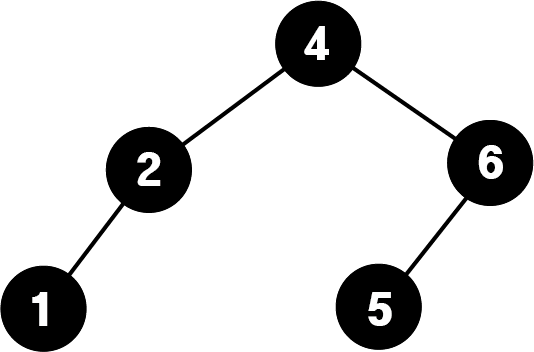
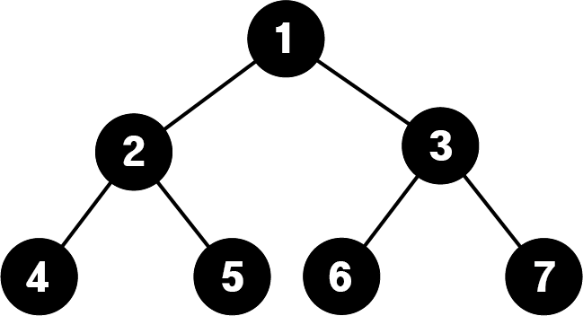
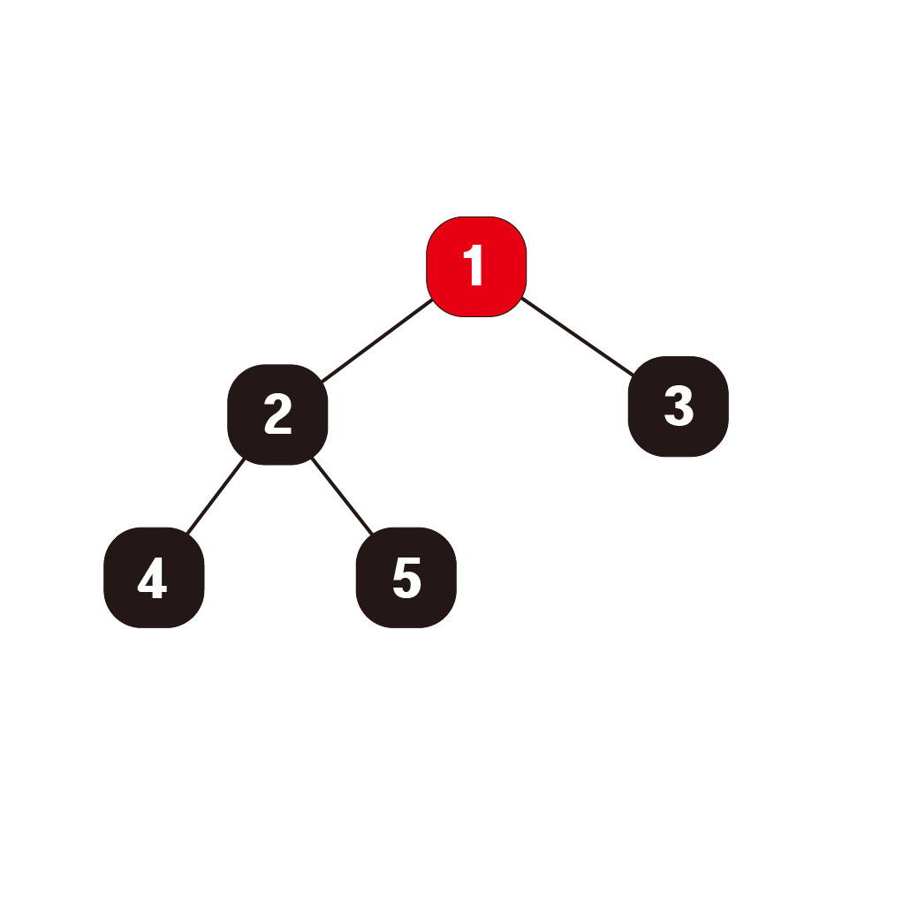
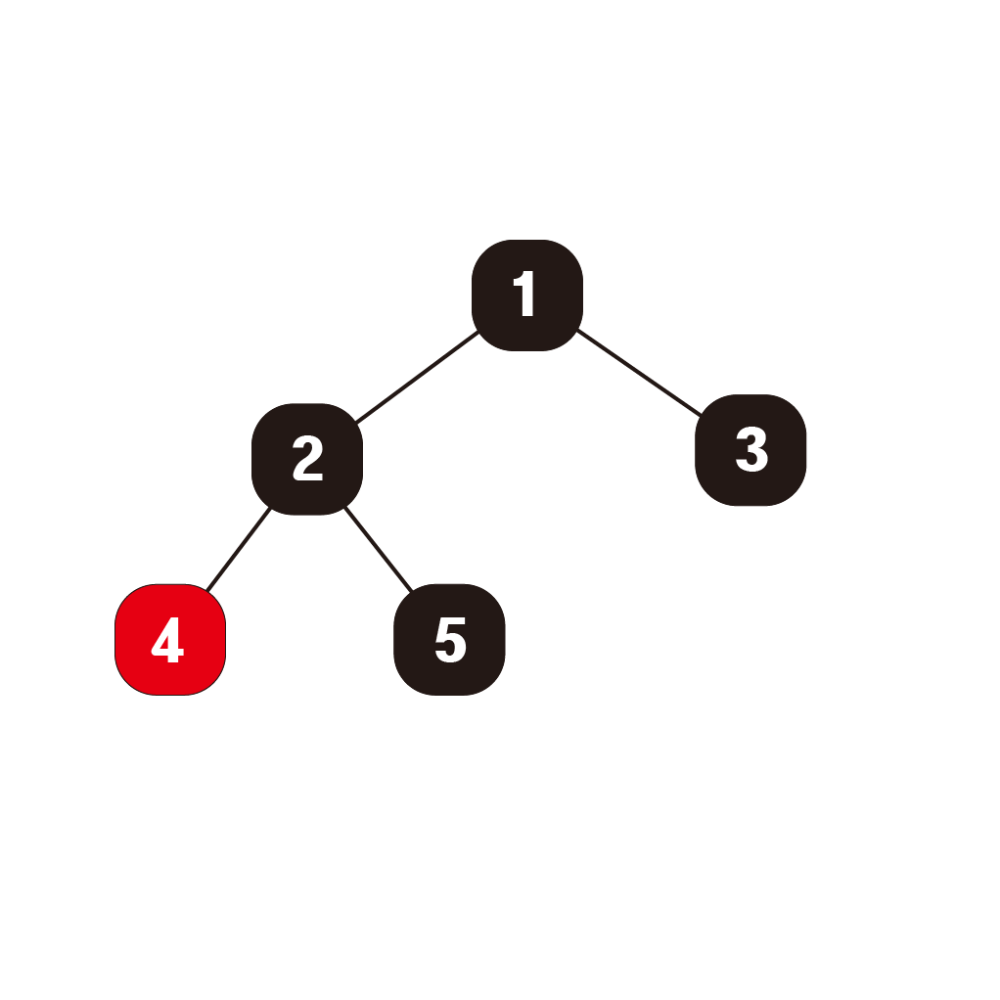

# 이진트리
## 1. 정의
이진트리란 트리들 중 모든 노드의 자식노드가 2개 이하인 트리를 이진트리라고 한다.

## 2. 이진트리의 종류

1. **[이진탐색트리(binary search tree)](./이진탐색트리.md)**

2. **완전이진트리 (complete binary tree)**

- 마지막 레벨을 제외한 모든 레벨은 채워져 있고 마지막 레벨은 왼쪽부터 차례로 채워진 트리이다.

- Heap tree가 완전이진트리에 속한다.




위의 트리는 완전이진트리에 속하지만 아래의 트리는 완전이진트리에 속하지 않는다.

3. **정이진트리 (full binary tree)**

- 모든 노드의 자식노드가 0개 혹은 2개인 이진트리

4. **포화이진트리 (perfect binary tree)**

- leaf노드를 제외하고 모든 노드의 자식노드가 2개인 이진트리이다.

- 노드의 개수는 항상 2<sup>h</sup>-1 이다.



5. **red-black tree**

6. **AVL tree**


## 3. 이진트리의 구현

이진트리는 자식노드가 왼쪽과 오른쪽 두개로 나뉘어져 있다.

```python
MAX_SIZE = 100
tree = [0 for i in range(MAX_SIZE)]
```

이진트리의 경우에는 일차원 배열 형태로 구현할 수 있다.

이때 1번 인덱스자리가 root node가 되며

n번 노드의 왼쪽 자식노드는 n*2

오른쪽 자식노드는 n*2+1 의 규칙을 가진다.

그러나 극단적인 경우에는 저장해야하는 데이터에 비해서 많은 양의 메모리를 필요로 한다. 아래 예시를 보자


해당 트리의 경우 5개의 노드를 저장하지만

1번 인덱스에 1, 3번 인덱스에 2, 7번 인덱스에 3, 15번 인덱스에 4, 31번 인덱스에 5를 저장하게 된다.

즉, 5개의 데이터를 저장하는데 31개의 인덱스를 가진 배열이 필요하므로 메모리 낭비가 심하다.

때문에 앞에서부터 차례로 채워지는 트리인 **완전이진트리** 를 구현할 때 이용하는 것이 좋다.

---

아래 코드는 배열이 아닌 클래스 형태로 구현한 이진트리이다.

```python
class Node:
    def __init__(self, data):
        self.data = data
        self.leftNode = None
        self.rightNode = None
    def __str__(self):
        return str(self.data)

class BinaryTree:
    def __init__(self):
        self.root = None
```

## 4. 이진트리의 순회

이진트리를 탐색하는 방법이다. 탐색순서에 따라 다음과 같이 나뉘어진다.

- preorder (전위순회)
- inorder (중위순회)
- postorder (후위순회)
- levelorder (계층순회)


### 1. 전위순회

(자기자신) -> (왼쪽 서브트리) -> (오른쪽 서브트리) 순서로 탐색한다.

위 트리의 경우 1 -> 2 -> 4 -> 5 -> 3 순서로 탐색한다.



``` python
def preorder(node):
    if node == None:
        return
    print(node.data)
    preorder(node.leftNode)
    preorder(node.rightNode)
```

### 2. 중위순회

(왼쪽 서브트리) -> (자기자신) -> (오른쪽 서브트리) 순서로 탐색한다.

위 트리의 경우 4 -> 2 -> 5 -> 1 -> 3 순서로 탐색한다.


``` python
def inorder(node):
    if node == None:
        return
    inorder(node.leftNode)
    print(node.data)
    inorder(node.rightNode)
```

### 3. 후위순회

(왼쪽 서브트리) -> (오른쪽 서브트리) -> (자기자신) 순서로 탐색한다.

위 트리의 경우 4 -> 5 -> 2 -> 3 -> 1 순서로 탐색한다.



``` python
def postorder(node):
    if node == None:
        return
    print(node.data)
    postorder(node.leftNode)
    postorder(node.rightNode)
```

### 4. 계층순회

루트 노드로부터 level이 가까운 순서대로 탐색한다.

위 트리의 경우 1 -> 2 -> 3 -> 4 -> 5 순서로 탐색한다.

구현시 queue를 이용하여 현재상태를 저장해가면서 구현한다.

BFS와 동일한 방식이므로 코드 형태를 기억해두면 좋다.


``` python
import queue
def levelorder(node):
    que = queue.Queue()
    que.put(node)
    while not que.empty():
        print(node.data)
        current = que.get()
        if current.leftNode != None:
            que.put(current.leftNode)
        if current.rightNode != Node:
            que.put(current.rightNode)
```
