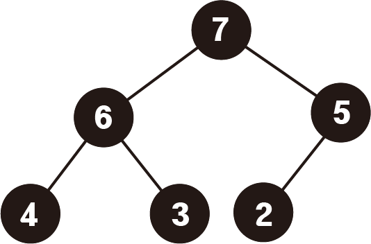
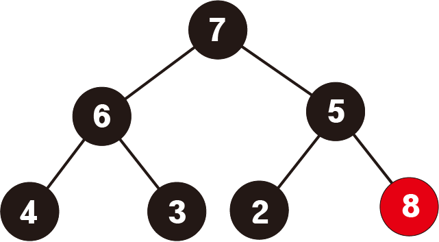
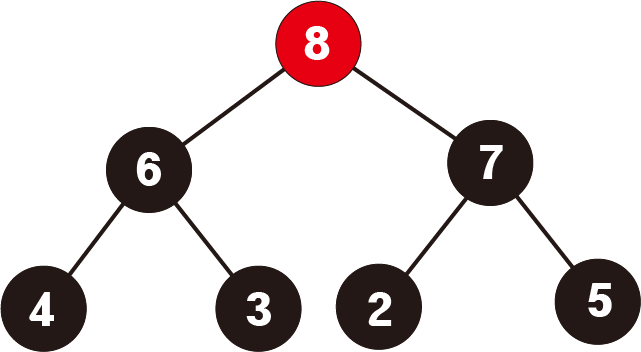
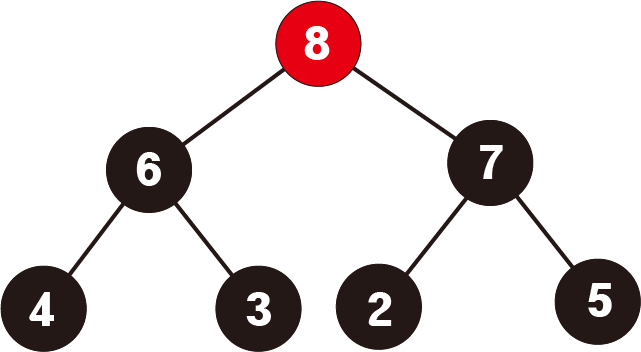
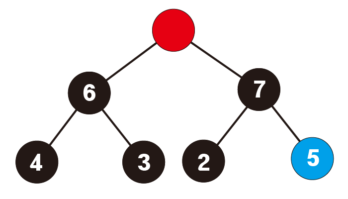
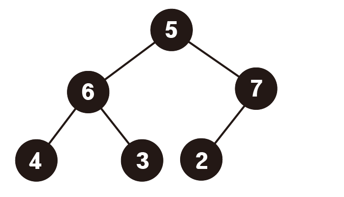

# 힙트리 (heap tree)

## 1. 정의

힙트리(Heap tree)는 부모노드의 우선순위가 자식노드의 우선순위보다 높은 형태를 가진 완전이진트리를 의미한다.

부모노드의 값이 자식노드의 값보다 큰 heap tree를 최대힙(Max heap)

부모노드의 값이 자시노드의 값보다 작은 heap tree를 최소힙(Min heap)이라고 한다.

아래는 최대힙의 예시이다.




## 2. 특징

힙트리는 삽입, 삭제가 용이한 자료구조이다. 우선순위가 높은 데이터를 다른 비교알고리즘 없이 바로 꺼낼 수 있다는 것이 장점이다.

queue처럼 데이터를 삽입하되 우선순위가 높은 데이터가 먼저 나오는 자료구조를 우선순위 큐(priority queue)라고 하며

이러한 우선순위큐를 구현하는 방법중 하나로써 heap tree를 이용한다.

## 3. 원리와 구현

### 기본 구조

힙트리는 완전 이진트리의 구조를 가지고 있다. 

기존의 이진트리처럼 하나의 노드가 자식노드들의 정보를 가지고 있는 형태로 구현을 해도 되지만

일차원 배열의 형태로서 n번째 노드의 왼쪽 자식노드는 n*2, 

오른쪽 자식노드는 n*2 + 1의 규칙으로 구현을 하는 것이 더 용이하다.

```python
class Node:
    def __init__(self, data):
        self.data = data
    def __str__(self):
        return str(self.data)
class HeapTree:
    def __init__(self):
        self.tree = [False]
        self.size = 0
```

### 삽입




위의 max heap에서 8을 삽입한다고 가정하자.

제일 먼저 트리의 마지막 자리에 8 노드를 추가한다.


그 후 부모노드의 값과 비교하며 우선순위가 높을 경우 자리를 바꾼다.


부모노드의 값보다 우선순위가 낮을 때까지 위의 과정을 반복한다.


```python
    def insert(self, data):
        self.tree.append(Node(data))
        self.size += 1
        pointer = self.size
        while pointer // 2 > 1:
            if self.tree[pointer] > self.tree[pointer // 2]:
                temp = self.tree[pointer]
                self.tree[pointer] = self.tree[pointer // 2]
                self.tree[pointer // 2] = temp
            else:
                break
```

### 삭제



힙에서의 데이터 삭제는 가장 우선순위가 높은 데이터를 삭제한다.

즉, 힙트리에서의 root노드를 삭제하는 과정이다.



위 트리에서 데이터를 삭제시킬 때는 루트노드인 8번 노드를 삭제한다.

그 후 왼쪽자식노드와 오른쪽 자식노드를 비교하여 우선순위가 높은 노드를 올린다.



다시 그 자식노드들 중 우선순위가 높은 노드를 올린다. 이 과정을 리프노드까지 반복한다.



```python
    def delete(self):
        result = self.tree[1]
        self.deleteNode(1)
        self.size -= 1
        return result
    
    def deleteNode(self, pointer):
        if self.size < pointer * 2:
            return
        if self.tree[pointer * 2] > self.tree[pointer * 2 + 1]:
            self.tree[pointer] = self.tree[pointer * 2]
            self.deleteNode(pointer * 2)
        else:
            self.tree[pointer] = self.tree[pointer * 2 + 1]
            self.deleteNode(pointer * 2 + 1)
```

### 모듈

위와 같은 기능을 하는 우선순위 큐는 파이썬에서 제공하고 있다.

우선순위 큐란 우선순위가 높은 데이터가 먼저 나오는 형식의 자료구조를 의미한다.

```python
from queue import PriorityQueue

que = PriorityQueue()
que.put(1) #우선순위 큐에 데이터를 삽입
que.get() #데이터를 삭제
```

이 때 기준은 최소힙으로 값이 작을 수록 먼저 나오는 형태이다.

최대힙, 혹은 원하는 우선순위를 적용시키고 싶다면 데이터 삽입시 튜플의 형태로 앞에 작은 값의 우선순위를 부여하면 된다.

```python
que.put((2, 'B'))
que.put((1, 'A'))
```

위처럼 할시 먼저 들어간 B보다 A가 먼저 나오게 된다.