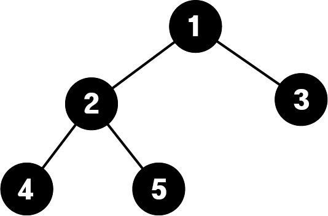

### 트리
## 1. 정의

노드끼리 연결된 형식의 자료구조
순환(cycle)이 없는 하나의 연결 그래프



## 2. 특징

하나의 루트노드를 가지고 있다.
노드와 노드들끼리의 관계를 이어주는 간선(edge)로 이루어져 있다.
사이클이 존재하지 않는다.

## 3. 용어

노드(node) : 데이터를 저장하는 기본 단위 (자료, 연관 노드들의 주소등을 포함하고 있다.)
간선(edge) : 노드의 연관 관계를 나타내주는 선
루트노드(root node): 트리에서 부모노드 없이 자식노드만을 가지고 있는 노드
                    하나의 트리당 하나의 루트노드만 가지고 있다.
단말노드(leaf node): 자식노드가 없는 노드
트리의 높이(height): root node부터 가장 낮은 층의 leaf node까지 거치는 간선의 개수
노드의 차수(degree): 각 노드가 가진 간선의 수
노드의 깊이(depth): root node로부터 각 노드까지 거쳐야하는 간선의 개수

## 4. 트리의 종류

1. 이진트리 (binary tree)
2. 이진탐색트리 (binary search tree)
3. 완전이진트리 (complete binary tree)
4. 정이진트리 (full binary tree)
5. 포화이진트리 (perfect binary tree)
6. red-black tree
7. AVL tree

위의 예제 모두 이진트리에 포함되어 있지만 이진트리가 아닌 트리들도 많이 있다.

## 5. 트리의 구현
각각의 노드가 자식노드들의 대한 정보를 가지고 있는 방식으로 구현할 수 있다.
```python
class Node:
    def __init__(self, data):
        self.data = data
        self.child = []
    def __str__(self):
        return str(self.data)
    def addChild(self, childnode):
        self.child.append(childnode)

class Tree:
    def __init__(self):
        self.root = None
```

혹은 그래프와 같이 각 노드들과 연관된 노드들간의 관계를 리스트에 저장함으로 표현할 수 있다.
[그래프](./그래프.md)를 참고하자