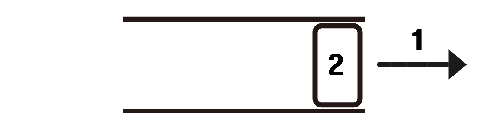

# 큐 (queue)

## 정의

먼저 들어간 데이터가 먼저 나오는 형태의 자료구조 (First-In-First-Out)


push 1


push 2



pop : 결과적으로 1이 pop되었다. 먼저 들어간 것이 우선적으로 pop되기 때문이다.

## 기능 및 구현

### 리스트로 구현하기

```python
from collections import deque

# 큐 생성
queue = deque()

# 큐에 데이터 추가 (enqueue)
queue.append(1)
print(f"Enqueued 1: {list(queue)}")

queue.append(2)
print(f"Enqueued 2: {list(queue)}")

queue.append(3)
print(f"Enqueued 3: {list(queue)}")

# 큐의 가장 앞에 있는 데이터 확인 (front)
print(f"Front of queue: {queue[0]}")

# 큐에서 데이터 제거 및 반환 (dequeue)
dequeued_value = queue.popleft()
print(f"Dequeued: {dequeued_value}")
print(f"Queue after dequeue: {list(queue)}")

# 큐가 비었는지 확인 (is_empty)
is_empty = len(queue) == 0
print(f"Is queue empty? {is_empty}")

# 큐의 크기 확인 (size)
size = len(queue)
print(f"Size of queue: {size}")

```