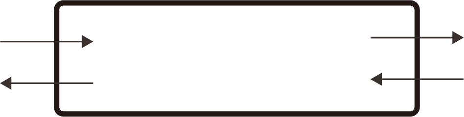

# 덱 (deque)

## 정의

양쪽에서 입력 및 출력을 할 수 있도록 하는 자료구조, 양방향 큐라고도 한다.

queue와 같은 이유로 리스트가 아닌 링크드리스트 형태로 구현을 한다.



## 구현

```python
from collections import deque

# 덱 생성
my_deque = deque()

# 오른쪽에 데이터 추가 (append)
my_deque.append(1)
my_deque.append(2)
print(f"Deque after appending to the right: {list(my_deque)}")

# 왼쪽에 데이터 추가 (appendleft)
my_deque.appendleft(0)
print(f"Deque after appending to the left: {list(my_deque)}")

# 오른쪽에서 데이터 제거 (pop)
right_pop = my_deque.pop()
print(f"Popped from the right: {right_pop}, Deque: {list(my_deque)}")

# 왼쪽에서 데이터 제거 (popleft)
left_pop = my_deque.popleft()
print(f"Popped from the left: {left_pop}, Deque: {list(my_deque)}")

# 오른쪽에 여러 데이터 추가 (extend)
my_deque.extend([3, 4, 5])
print(f"Deque after extending to the right: {list(my_deque)}")

# 왼쪽에 여러 데이터 추가 (extendleft)
my_deque.extendleft([-2, -1])
print(f"Deque after extending to the left: {list(my_deque)}")

# 덱의 데이터를 오른쪽으로 2칸 회전 (rotate)
my_deque.rotate(2)
print(f"Deque after rotating 2 steps to the right: {list(my_deque)}")

# 덱의 데이터를 왼쪽으로 2칸 회전 (rotate)
my_deque.rotate(-2)
print(f"Deque after rotating 2 steps to the left: {list(my_deque)}")


```