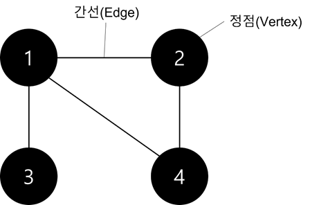
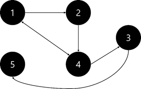
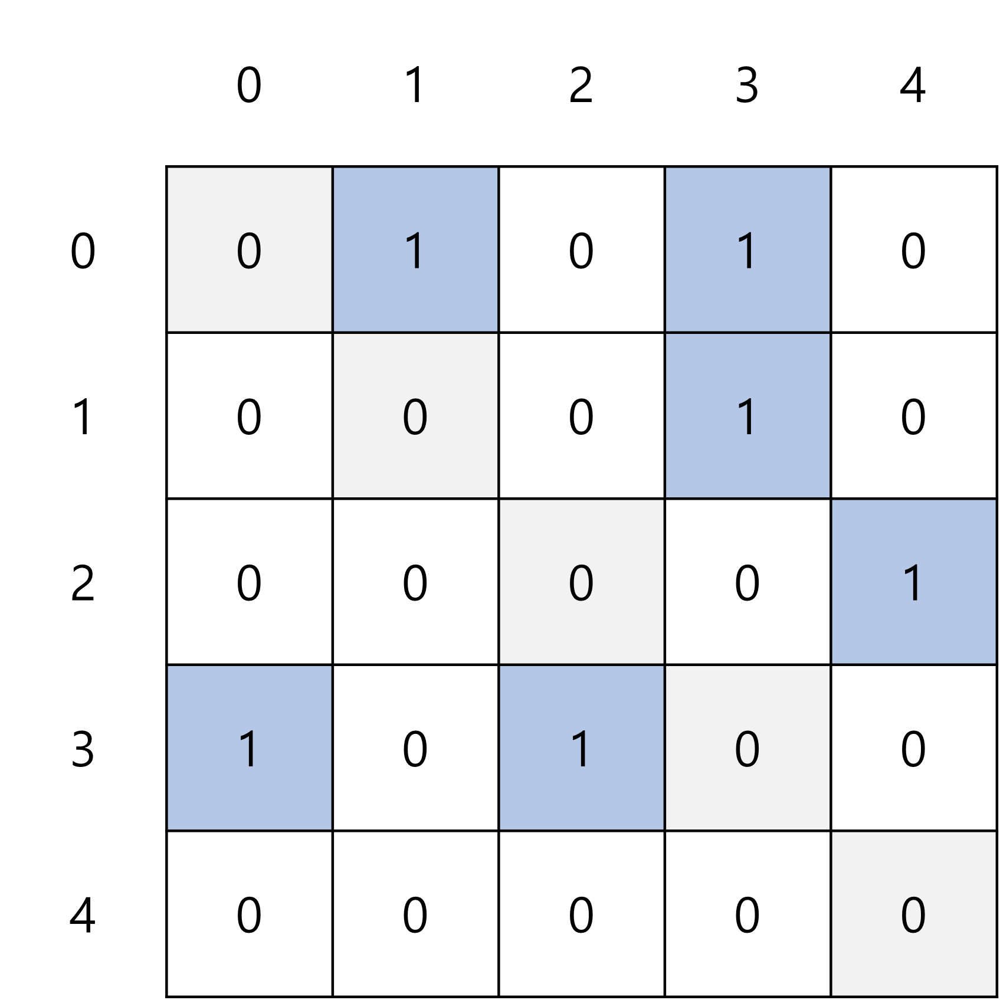
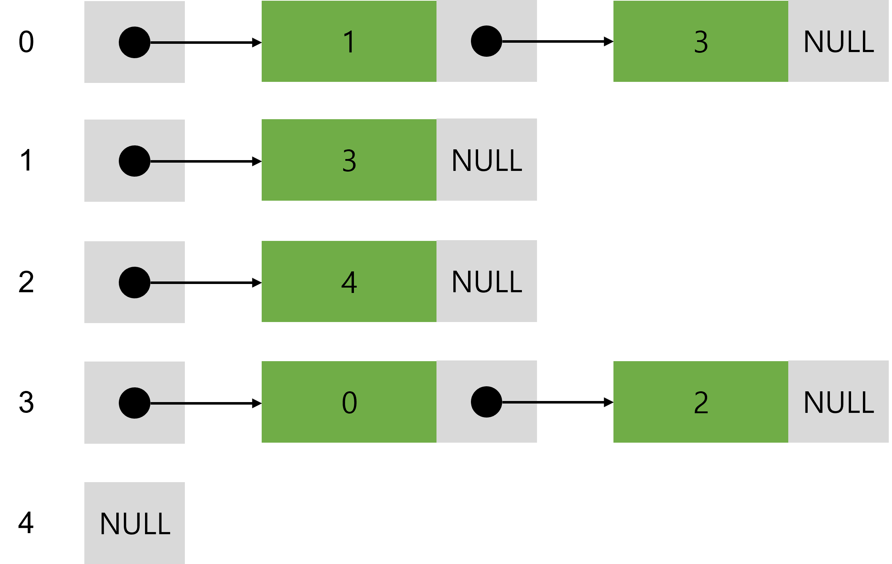

# 파이썬 알고리즘 CHAPTER2

## 1. 그래프 자료구조(인접행렬, 인접리스트) + 트리

### **그래프**

객체 사이의 연결 관계를 표현하는 자료구조로 정점과 간선으로 구성되어 있다.



**그래프 용어**

정점(Vertex): 노드(Node)라고도 하며 데이터가 저장되는 그래프의 기본 원소이다.

위의 예시 그래프에서는 정점이 총 4개로 [1, 2, 3, 4]이다.

간선(Edge): 정점과 정점 사이에 있는 선으로 링크(Link)라고도 하며 정점 간의 관계를 의미한다.

위의 예시 그래프에서는 간선이 총 4개로 (1, 4), (1, 2), (1, 3), (2, 3)이다.

인접 정점(Adjacent Vertex): 간선에 의해 직접 연결된 정점으로 바로 옆에 있는 정점을 말한다.

위의 예시 그래프에서는 1의 인접 정점은 [2, 3, 4]이고, 2의 인접 정점은 [1, 4]이다.

차수(Degree): 하나의 정점에 연결된 간선의 수를 말한다. 방향 그래프에서는 다른 정점에서 들어오는 간선의 수를 진입 차수(In-Degree)와 다른 정점으로 나가는 간선의 수를 진출 차수(Out-Degree)라고 한다.

위의 예시 그래프에서 1의 차수는 3이고, 2의 차수는 2이다.

경로(Path): 정점에서 다른 정점을 가기 위해 거치는 정점을 나열하여 표시한다. (단, 거치는 정점과 정점사이에는 간선이 존재해야 한다.)

위의 예시 그래프에서 정점 3으로부터 정점 2로 가는 경로는 3 – 1 - 2이다.

사이클(Cycle): 다른 정점을 거쳐서 처음의 정점으로 돌아오는 경로를 사이클이라고 한다. 즉, 시작 정점과 종료 정점이 같은 경우를 말한다.

위의 예시 그래프에서는 경로 1 - 2 – 4 - 1을 사이클이라고 한다.

**무방향 그래프(Undirected Graph)**

간선에 방향이 없는 그래프를 말한다. 그래서 정점과 정점 사이에 간선이 있다면 양 방향으로 이동이 가능하다.


**방향 그래프(Directed Graph)**

간선에 방향이 있는 그래프를 말한다. 그래서 간선의 방향으로만 정점 사이의 이동이 가능하다.


**가중치 그래프(Weighted Graph)**	

간선에 비용이 있는 그래프를 말한다. 그래서 정점과 정점 사이를 이동할 때마다 비용이 발생한다.


**완전 그래프(Complete Graph)**

모든 정점이 간선으로 연결되어 있는 그래프이다.


### 그래프 구현 방법 설명

**인접 행렬**

인접 행렬로 그래프를 표현할 때는 그래프의 연결 관계를 2차원 배열로 나타낸다.

정점 a에서 정점 b로 이동하는 간선이 존재하면 1(adj_list[a][b] = 1), 존재하지 않으면 0(adj_list[a][b] = 0)으로 표현을 한다.

**무방향 그래프**를 인접 행렬로 나타내면 아래와 같다. 무방향 그래프는 양방향을 가도 된다는 뜻을 말하므로 대각선(회색 칸)을 중심으로 대칭을 이룬다. 

{: weight="50%" height="50%"}

{: weight="50%" height="50%"}

**배열에서는 index가 0번째부터 시작하므로 모든 수에서 1을 뺀 값으로 행렬을 구성하였다. **

위의 무방향 그래프를 인접행렬로 나타내는 코드는 아래와 같다. 

```python
size = 5

vertex = [[0, 1], [0, 2], [0, 4], [1, 3], [1, 4], [2, 3], [3, 4]]
#vertex를 잇는 edge표시

adj_list = [[0 for _ in range(size)] for _ in range(size)]
#adj_list[5][5]인 배열 선언

for src, dst in vertex:
    adj_list[src][dst] = 1
    adj_list[dst][src] = 1
#양방향으로 이동 가능하도록 두 번 배열에 입력

print(adj_list)
```

0→1이 이동 가능하면 양방향이 가능하므로 adj_list[0][1] = 1, adj_list[1][0] = 1 로 나타난다. 

///////

**방향 그래프**를 인접 행렬로 나타내면 아래와 같다. 방향 그래프는 무방향 그래프와 다르게 방향이 정해져 있으므로 대각선(회색칸)을 기준으로 대칭을 이루지 않는다.

{: weight="50%" height="50%"}

{: weight="50%" height="50%"}

**배열에서는 index가 0번째부터 시작하므로 모든 수에서 1을 뺀 값으로 행렬을 구성하였다. **

위의 방향 그래프를 인접 행렬로 나타내는 코드는 아래와 같다. 

```python
size = 5

vertex = [[0, 1], [0, 3], [1, 3], [2, 0], [3, 0],[3, 2]]
#vertex를 잇는 edge표시

adj_list = [[0 for _ in range(size)] for _ in range(size)]
#adj_list[5][5]인 배열 선언

for src, dst in vertex:
    adj_list[src][dst] = 1
#한쪽 방향으로만 이동 가능하도록 한 번만 배열에 입력

print(adj_list)
```

0→1이 이동 가능하면 adj_list[0][1] = 1로 나타난다. 

/////////////

  

**인접 리스트**

인접 리스트로 그래프를 표현할 때는 각각의 vertex에 연결된 vertex를 원소로 갖는 1차원 배열로 나타낸다.

정점 a에서 정점 b로 이동하는 간선이 존재하면 adj_list[a]에 b가 원소로 들어가 있고, 존재하지 않으면 adj_list[a]에 b가 원소로 들어가 있지 않다. 

**무방향 그래프**를 인접 리스트로 나타내면 아래와 같다. 

{: weight="50%" height="50%"}

{: weight="50%" height="50%"}

**배열에서는 index가 0번째부터 시작하므로 모든 수에서 1을 뺀 값으로 행렬을 구성하였다. **

vertex 2(vertex 3에서 1을 뺀 값)와 연결된 정점은 [0, 3, 4]이다. 이 정점이 adj_list[2]의 원소로 구성되어 있다.  

위의 방향 그래프를 인접 리스트로 나타내는 코드는 아래와 같다. 

```python
size = 5
vertex = [[0, 1], [0, 2], [0, 4], [1, 3], [1, 4], [2, 3], [3, 4]]
#vertex를 잇는 edge표시

adj_list = [[] for _ in range(size)]
#adj_list[5]인 배열 선언

for src, dst in vertex:
    adj_list[src].append(dst)
		adj_list[dst].append(src)
#양방향으로 이동 가능하도록 두 번 배열에 입력

print(adj_list)
```

**방향 그래프**를 인접 리스트로 나타내면 아래와 같다. 

{: weight="50%" height="50%"}

{: weight="50%" height="50%"}

**배열에서는 index가 0번째부터 시작하므로 모든 수에서 1을 뺀 값으로 행렬을 구성하였다. **

vertex 3(vertex 4에서 1을 뺀 값)와 연결된 정점은 [0, 2]이다. 이 정점이 adj_list[3]의 원소로 구성되어 있다.  

위의 무방향 그래프를 인접 리스트로 나타내는 코드는 아래와 같다. 

```python
size = 5
vertex = [[0, 1], [0, 3], [1, 3], [2, 0], [3, 0],[3, 2]]
#vertex를 잇는 edge표시

adj_list = [[] for _ in range(size)]
#adj_list[5]인 배열 선언

for src, dst in vertex:
    adj_list[src].append(dst)
#한쪽 방향으로만 이동 가능하도록 한 번만 배열에 입력

print(adj_list)
```

/////////////////

### 트리

## 2. DFS & BFS

그래프를 탐색할 때 사용하는 기법이다. 

### BFS(Breadth First Search, 너비 우선 탐색)

너비를 우선해서 탐색하는 기법으로 시작 점인 노드와 같은 거리에 있는 노드를 우선으로 탐색한다. 

**구현 방법**

queue를 이용하여 구현할 수 있다. 

탐색한 노드를 queue에 넣어주고 queue의 맨 앞에 있는 노드에 인접한 노드(이미 탐색한 노드는 제외)를 queue에 넣어주면서 모든 노드를 탐색한다.

 

**트리에서의  BFS 탐색 과정**


먼저 1번 노드에서 탐색을 시작한다. 

queue에 1을 push 해준다. 

<queue>의 현재 상태


1번 노드와 연결된 노드 중 2번 노드를 탐색한다. 

queue에서 1을 pop하고  2를 push해준다.

<queue>의 현재 상태


1번 노드와 연결된 노드 중 탐색하지 않은 노드인 3번 노드를 탐색한다. 

queue에 3을 넣어준다.

<queue>의 현재 상태 


1번 노드와 연결된 모든 노드를 탐색했으므로 다음으로 탐색했던 2번 노드와 연결된 노드 중 4번 노드를 탐색한다. 

queue에서 2를 pop하고 4를 push해준다. 

<queue>의 현재 상태


2번 노드와 연결된 노드 중 탐색하지 않은 노드인 5번 노드를 탐색한다. 

queue에 5를 push해준다.

<queue>의 현재 상태


2번 노드와 연결된 모든 노드를 탐색했으므로 2번 노드 다음으로 탐색한 3번 노드와 연결된 노드인 6번 노드를 방문한다. 

queue에서 3을 pop해주고, 6을 push해준다. 

<queue>의 현재 상태


3번 노드와 연결된 모든 노드를 탐색했으므로, 3번 노드 다음으로 탐색한 4번 노드와 연결된 노드를 탐색한다. 4번 노드와 연결된 노드가 없으므로 그 다음으로 탐색한 5번 노드와 연결된 노드 중 7번 노드를 탐색한다. 

queue에서 4를 pop해주고, 5도 pop해준 후 7을 push해준다. 

<queue>의 현재 상태


같은 방법으로 반복하여 모든 노드를 탐색한다.

queue에 아무것도 없으면 탐색을 종료한다. 

<queue>의 현재 상태


위와 과정을 통해 탐색을 하면 1 → 2 → 3 → 4 → 5 → 6 → 7 → 8 → 9 → 10 → 11 → 12의 순서로 탐색을 진행하게 된다.  

### DFS(Depth First Search, 깊이 우선 탐색)

DFS는 루트 노드, 혹은 그래프에서 하나의 정점에서 시작해서 다른 길을 탐색하기 전 탐색하는 길의 모든 경우를 탐색 하는 알고리즘이다.

미로에서 길을 찾을 때 갈림길에서 하나의 길로 갈 수 있는 모든 경우를 탐색한 뒤 다른 길을 탐색하는 것과 같은 방법이다.

주로 경우의 수 문제에서 모든 경우를 탐색해야 할 때 사용한다.

**구현 방법**

재귀함수를 이용한 방식과 stack을 이용한 방식으로 총 2개의 방식으로 구현을 할 수 있다. 

**트리에서의 DFS 탐색 과정**


먼저 1번 노드에서 탐색을 시작한다.

stack에 1을 push한다. 


1번 노드와 연결된 노드 중 한 개의 노드를 탐색한다.

stack에 2를 push한다. 


3번 노드를 탐색하지 않고 2번과 연결된 다른 노드 중 4번 노드를 탐색한다.

stack에 4를 push한다. 


4번 노드에서 탐색할 수 있는 다른 노드가 없으므로 2번과 연결된 5번 노드를 탐색한다.

stack에서 pop을 한 번 해서 4를 없애고, 5를 push한다. 


5번과 연결된 노드 중 탐색할 수 있는 노드인 7번 노드를 탐색한다.

stack에 7을 push한다. 


같은 방법으로 반복하여 모든 노드를 탐색한다.


### 이때 한번 탐색을 진행했던 노드는 다시 탐색하지 않도록 체크해야 한다.

만약 다시 탐색을 진행하게 된다면 조건에 따라 loop에 빠질 수도 있다.

위의 과정을 통해 탐색을 하면 1 → 2 → 4 → 5 → 7 → 10 → 12 → 8 → 3 → 6 → 9 → 11 의 순서로 탐색을 진행하게 된다. 

### 인접 행렬로 구현된 그래프에서의 dfs

**시간복잡도**

$$O(V^2)$$

**재귀 함수로 DFS 구현**

```python
n = 12 #node의 개수
check = [False for _ in range(n)] #방문여부를 체크하기 위한 배열
#인접행렬로 구현된 그래프
graph = [[0, 1, 1, 0, 0, 0, 0, 0, 0, 0, 0, 0],
				[0, 0, 0, 1, 1, 0, 0, 0, 0, 0, 0, 0],
				[0, 0, 0, 0, 0, 1, 0, 0, 0, 0, 0, 0],
				[0, 0, 0, 0, 0, 0, 0, 0, 0, 0, 0, 0],
				[0, 0, 0, 0, 0, 0, 1, 1, 0, 0, 0, 0],
				[0, 0, 0, 0, 0, 0, 0, 0, 1, 0, 0, 0],
				[0, 0, 0, 0, 0, 0, 0, 0, 0, 1, 0, 0],
				[0, 0, 0, 0, 0, 0, 0, 0, 0, 0, 0, 0],
				[0, 0, 0, 0, 0, 0, 0, 0, 0, 0, 1, 0],
				[0, 0, 0, 0, 0, 0, 0, 0, 0, 0, 0, 1],
				[0, 0, 0, 0, 0, 0, 0, 0, 0, 0, 0, 0],
				[0, 0, 0, 0, 0, 0, 0, 0, 0, 0, 0, 0]]

#dfs함수 구현
"""
parameter : 
	n : 노드개수
	graph : 그래프
	current : 현재 탐색중인 노드
"""
def dfs(n,graph,current):
	check[current] = True #방문 여부 체크
	print(current)
	#반복문 돌면서 방문하지 않은 노드를 우선으로 탐색 (재귀적 탐색)
	for i in range(n):
		if graph[current][i] == 1:
			dfs(n, graph, i)

#함수 실행
dfs(n,current,0)
```

- DFS 그래프 및 순서도 보여주기 + 구현 방법 설명
- DFS를 이용한 예제 문제
- BFS 그래프 및 순서도 보여주기 + 구현 방법 설명
- BFS를 이용한 예제 문제

## 3. 백트래킹

- 백트래킹 설명
- 백트래킹을 이용한 예제 문제

## 4. 이분탐색

- 이진 탐색 설명 + 구현 방법 설명
- 이진 탐색을 이용한 예제 문제

## 5. 동적계획법1(Top Down & Bottom Up)